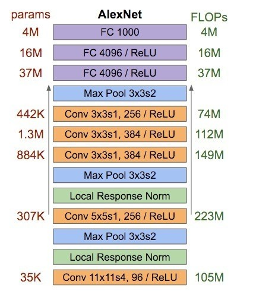
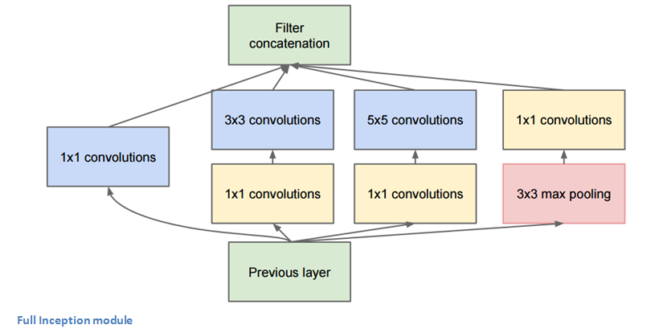
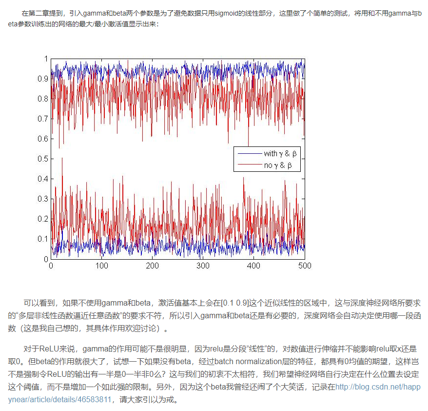
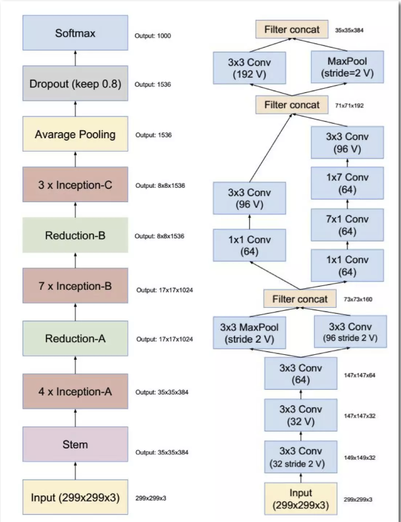
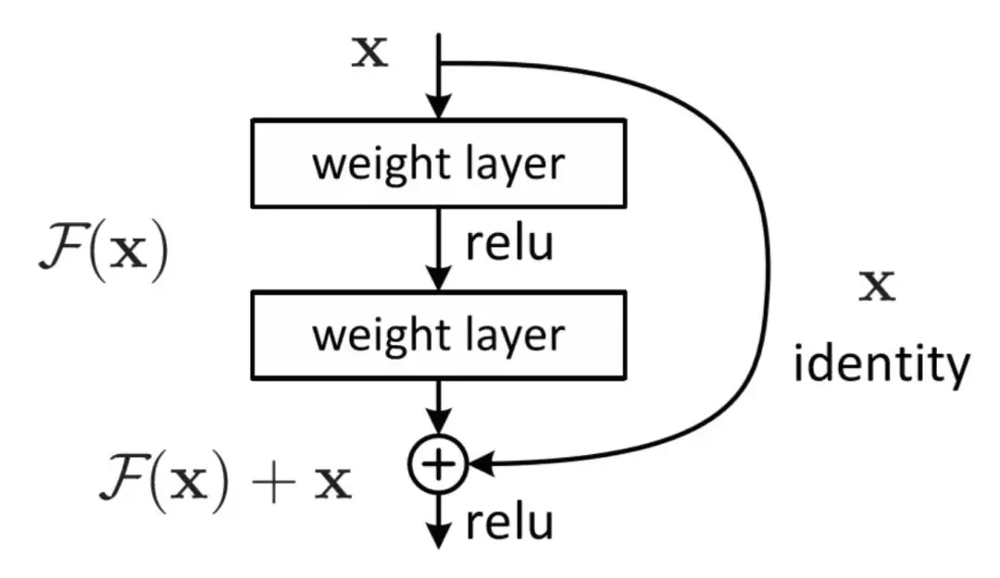
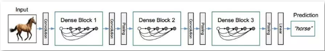

# 分类网络

### 几篇综述

* [深度学习之四大经典CNN技术浅析 | 硬创公开课](https://www.leiphone.com/news/201702/dgpHuriVJHTPqqtT.html)
    * AlexNet:
        * 拥有5个卷积层，其中3个卷积层后面连接了最大池化层，最后还有3个全连接层。
    * VGGNet :
        * 全部利用3*3的卷积和2*2的池化，取代大的卷积核。
* [The 9 Deep Learning Papers You Need To Know About](https://adeshpande3.github.io/The-9-Deep-Learning-Papers-You-Need-To-Know-About.html)
* [如何评价 Squeeze-and-Excitation Networks ?](https://www.zhihu.com/question/65044831/answer/227262160)

## 0. 数据处理

[github: DL-Data](https://github.com/jiye-ML/DL-Data)
* 当你训练一个机器学习模型时，你实际做工作的是调参，以便将特定的输入（一副图像）映像到输出（标签）。
我们优化的目标是使模型的损失最小化， 以正确的方式调节优化参数即可实现这一目标。

## 1. AlexNet

* [paper](paper/2012-AlexNet.pdf)

### 1.1 核心观点

* 在ImageNet数据集上训练网络, 15 million 标注图片 超过 22,000 类别.

### AlexNet主要使用到的新技术点如下。

1. 成功使用ReLU作为CNN的激活函数，并验证其效果在较深的网络超过了Sigmoid，成功解决了Sigmoid在网络较深时的梯度弥散问题。
虽然ReLU激活函数在很久之前就被提出了，但是直到AlexNet的出现才将其发扬光大。
2. 训练时使用Dropout随机忽略一部分神经元，以避免模型过拟合。Dropout虽有单独的论文论述，但是AlexNet将其实用化，
通过实践证实了它的效果。在AlexNet中主要是最后几个全连接层使用了Dropout。
3. 在CNN中使用重叠的最大池化。此前CNN中普遍使用平均池化，AlexNet全部使用最大池化，避免平均池化的模糊化效果。
并且AlexNet中提出让步长比池化核的尺寸小，这样池化层的输出之间会有重叠和覆盖，提升了特征的丰富性。
5. 提出了LRN层，对局部神经元的活动创建竞争机制，使得其中响应比较大的值变得相对更大，并抑制其他反馈较小的神经元，增强了模型的泛化能力。
6. 数据增强，随机地从256´256的原始图像中截取224´224大小的区域（以及水平翻转的镜像），
相当于增加了(256-224)2´2=2048倍的数据量。如果没有数据增强，仅靠原始的数据量，参数众多的CNN会陷入过拟合中，
使用了数据增强后可以大大减轻过拟合，提升泛化能力。进行预测时，则是取图片的四个角加中间共5个位置，并进行左右翻转，
一共获得10张图片，对他们进行预测并对10次结果求均值。同时，AlexNet论文中提到了会对图像的RGB数据进行PCA处理，
并对主成分做一个标准差为0.1的高斯扰动，增加一些噪声，这个Trick可以让错误率再下降1%。

* 使用批随机梯度下降算法训练网络, 使用特殊值作为动量和权值衰减。
* Trained on two GTX 580 GPUs 5/6天。

## 2. VGG Net

* [paper](paper/2014-Very%20deep%20convolutional%20networks%20for%20large-scale%20image%20recognition.pdf)
    * 网络结构 \
    
    * 核心观点
        * 仅仅使用3x3 卷积核，作者认为组合2个 3x3 卷积层和5x5核具有一样的感受野。这使得卷积核尺寸表现，感受野不变。
        一个好处是减少了参数量。
        * 随着输入空间尺寸的变小，通道数不断加大
        * 每次池化之后都是用多个卷积层，这诠释了空间尺度缩小的时候，深度加深。
        * 在训练过程中使用scale jittering作为一种数据增强技术。
        * 使用每个卷积层后使用ReLU层并且通过 batch gradient descent训练。
    * 比其他网络表现力更强，与gooleNet相比，网络架构更简单。
    * 3*3网络的优势：
        1. 每一个卷积后面接ReLU，这样更加非线性
        2. 参数量少 3个3x3的卷积相当于一个7x7的卷积，感受野相同。
    * 可以试着实现一些trick
        1. momentum SGD 0.9
        2. weight decay L2 * 5e-4
        3. drop out 0.5
        4. learning rate = 1e-2, 当验证集准确度不在提升时，衰减10， 衰减3次
        5. 初始化方式，预训练
    * 初始化策略
        * 可以在一个小的网络上训练然后初始化
        * 训练11层的网络，然后利用11层的网络初始化相应的16层的网络
        * 可以利用256的数据训练，然后初始化384数据的网络
    
* [大话CNN经典模型：VGGNet](https://my.oschina.net/u/876354/blog/1634322)

## 3. GooleNet

* [大话CNN经典模型：GoogLeNet（从Inception v1到v4的演进）](https://my.oschina.net/u/876354/blog/1637819)
    * 一般来说，提升网络性能最直接的办法就是增加网络深度和宽度，深度指网络层次数量、宽度指神经元数量。但这种方式存在以下问题：
        1. 参数太多，如果训练数据集有限，很容易产生过拟合；
        2. 网络越大、参数越多，计算复杂度越大，难以应用；
        3. 网络越深，容易出现梯度弥散问题（梯度越往后穿越容易消失），难以优化模型。
    * GoogLeNet采用了模块化的结构（Inception结构），方便增添和修改；
    * 为了避免梯度消失，网络额外增了2个辅助的softmax用于向前传导梯度（辅助分类器）。
    辅助分类器是将中间某一层的输出用作分类，并按一个较小的权重（0.3）加到最终分类结果中，这样相当于做了模型融合，
    同时给网络增加了反向传播的梯度信号，也提供了额外的正则化，对于整个网络的训练很有裨益。而在实际测试的时候，
    这两个额外的softmax会被去掉。(也可以防止梯度长距离传播带来的爆炸或者消失);
    * Inception V3一个最重要的改进是分解（Factorization），将7x7分解成两个一维的卷积（1x7,7x1），
    3x3也是一样（1x3,3x1），这样的好处，既可以加速计算，又可以将1个卷积拆成2个卷积，使得网络深度进一步增加，
    增加了网络的非线性（每增加一层都要进行ReLU）。另外，网络输入从224x224变为了299x299。
    * Inception V4研究了Inception模块与残差连接的结合。ResNet结构大大地加深了网络深度，还极大地提升了训练速度，
    同时性能也有提升
    
### Network in Network

* [paper](paper/2014-Network%20In%20Network.pdf)
    * 利用全局池化代替全连接
        * 目的是生成一张特征图为每个类别，
        * 每张特征图对应一个类别，更好的可解释性，
        * 没有需要优化的参数，避免了这一层的过拟合。
* [One by One [ 1 x 1 ] Convolution - counter-intuitively useful](https://iamaaditya.github.io/2016/03/one-by-one-convolution/)
    * 1x1 的卷积网络具有减少深度的作用
    * 1x1卷积是线性的，但是后面一般都会接一个ReLU非线性激活单元。
    * 首先在 《Network in Network》论文中提出 \
    

    
### [v1] Going Deeper withConvolutions

* [paper](paper/2015-Going%20Deeper%20with%20Convolutions.pdf)
    * 核心观点
        * 第一个只是使用卷积和池化的堆叠的网络。
        * 使用9个Inception modules在整个网络中，超过100层.
        * 没有使用全连接层，使用全局平均池化将7x7x1024 volume到1x1x1024 volume. 节省了大量的参数。
        * 测试阶段, 使用multiple crops在一张图片上，softmax probabilities是平均值.
    * 当我们观察GoogLeNet的结构的时候，我们注意到不是每件事都是序列发生的。

### [v2] Batch Normalization:Accelerating Deep Network Training by Reducing Internal Covariate Shift

* [paper](paper/2015-Batch%20Normalization%20Accelerating%20Deep%20Network%20Training%20by%20Reducing%20Internal%20Covariate%20Shift.pdf)
    * BN本质上解决的是反向传播过程中的梯度问题。
    
* [利用随机前馈神经网络生成图像观察网络复杂度](https://blog.csdn.net/happynear/article/details/46583811)
    * 用实验的方法解释了 BN中 连个参数都很重要。
    * 2维的数据点，由于图像数据的每一维一般都是0-255之间的数字，因此数据点只会落在第一象限，而且图像数据具有很强的相关性，
    比如第一个灰度值为30，比较黑，那它旁边的一个像素值一般不会超过100，否则给人的感觉就像噪声一样。
    由于强相关性，数据点仅会落在第一象限的很小的区域中，形成类似上图所示的狭长分布。
    * wx+b=0开始的时候表现为0附近的一条分割线，这样归一化数据可以带来计算量降低；
    * 而在RElu之后，数据也是在第一象限的，需要对数据进行归一化；使用BN；文章中说这样做在训练初期，分界面还在剧烈变化时，
    计算出的参数不稳定，所以退而求其次，在Wx+b之后进行归一化,先把输出利用BN拉到一定的返回再进行激活。
    因为初始的W是从标准高斯分布中采样得到的，而W中元素的数量远大于x，Wx+b每维的均值本身就接近0、方差接近1，
    所以在Wx+b后使用Batch Normalization能得到更稳定的结果。
    * 文中使用了类似z-score的归一化方式：每一维度减去自身均值，再除以自身标准差，由于使用的是随机梯度下降法，
    这些均值和方差也只能在当前迭代的batch中计算，故作者给这个算法命名为Batch Normalization。这里有一点需要注意，
    像卷积层这样具有权值共享的层，Wx+b的均值和方差是对整张map求得的，在batch_size * channel * height * width这么大的一层中，
    对总共batch_size * height * width个像素点统计得到一个均值和一个标准差，共得到channel组参数。
    * 引入gamma和beta两个参数是为了避免数据只用sigmoid的线性部分；其实如果是仅仅使用上面的归一化公式，
    对网络某一层A的输出数据做归一化，然后送入网络下一层B，这样是会影响到本层网络A所学习到的特征的。
    打个比方，比如我网络中间某一层学习到特征数据本身就分布在S型激活函数的两侧，你强制把它给我归一化处理、标准差也限制在了1，
    把数据变换成分布于s函数的中间部分，这样就相当于我这一层网络所学习到的特征分布被你搞坏了，变换重构，
    引入了可学习参数γ、β，这就是算法关键之处：因此我们引入了这个可学习重构参数γ、β，让我们的网络可以学习恢复出原始网络所要学习的特征分布。
    
    * 算法优势
        1. 可以使用更高的学习率。如果每层的scale不一致，实际上每层需要的学习率是不一样的，
        同一层不同维度的scale往往也需要不同大小的学习率，通常需要使用最小的那个学习率才能保证损失函数有效下降，
        Batch Normalization将每层、每维的scale保持一致，那么我们就可以直接使用较高的学习率进行优化。
        2. 移除或使用较低的dropout。 dropout是常用的防止overfitting的方法，而导致overfit的位置往往在数据边界处，
        如果初始化权重就已经落在数据内部，overfit现象就可以得到一定的缓解。论文中最后的模型分别使用10%、5%和0%的dropout训练模型，
        与之前的40%-50%相比，可以大大提高训练速度。
    
* [《Batch Normalization Accelerating Deep Network Training by Reducing Internal Covariate Shift》论文解读](https://www.cnblogs.com/dmzhuo/p/5889157.html)
    1. 归一化：
        * 原因在于神经网络学习过程本质就是为了学习数据分布，一旦训练数据与测试数据的分布不同，那么网络的泛化能力也大大降低；
        * 一旦每批训练数据的分布各不相同，那么网络就要在每次迭代都去学习适应不同的分布，这样将会大大降低网络的训练速度；
    2. 传递性
        * 网络的前面几层发生微小的改变，那么后面几层就会被累积放大下去。
        * 一旦网络某一层的输入数据的分布发生改变，那么这一层网络就需要去适应学习这个新的数据分布，所以如果训练过程中，
        训练数据的分布一直在发生变化，那么将会影响网络的训练速度。
    
* [基础 | batchnorm原理及代码详解](https://blog.csdn.net/qq_25737169/article/details/79048516)
    * 每层输出的均值和归一化处理

* [详解深度学习中的Normalization，不只是BN](04.详解深度学习中的Normalization，不只是BN.docx)
* 

### [v3] Rethinking theInception Architecture for Computer Vision

* [paper](paper/2015-Rethinking%20the%20Inception%20Architecture%20for%20Computer%20Vision.pdf)
    * 论文做出的贡献主要有4个
        1. 分解大filters，使其小型化、多层化，其中有个“非对称卷积”很新颖
        2. 优化inception v1的auxiliary classifiers
        3. 提出一种缩小特征图大小的方法，说白了就是一种新的、更复杂的pooling层
        4. Label smooth，“标签平滑”，很难用中文说清楚的一种方法
    
* Szegedy还把一段时间内的科研心得总结了一下，在论文里写了4项网络设计基本原则：
    1. 尽量避免representational bottlenecks，这种情况一般发生在pooling层，字面意思是，pooling后特征图变小了，
    但有用信息不能丢，不能因为网络的漏斗形结构而产生表达瓶颈，解决办法是上面提到的贡献3
    2. 采用更高维的表示方法能够更容易的处理网络的局部信息，我承认前面那句话是我硬翻译的，principle 2我确实不太明白
    3. 把大的filters拆成几个小filters叠加，不会降低网络的识别能力，对应上面的贡献1
    4. 把握好网络深度和宽度的平衡，这个原则说了等于没说

### [v4] Inception-v4,Inception-ResNet and the Impact of Residual Connections on Learning

* [paper](paper/2016-Inception-v4,%20Inception-ResNet%20and%20the%20Impact%20of%20Residual%20Connections%20on%20Learning.pdf)

## 4. ResNet

* [大话深度残差网络（DRN）ResNet网络原理](https://my.oschina.net/u/876354/blog/1622896)

* [ImageNet: VGGNet, ResNet, Inception, and Xception with Keras](https://www.pyimagesearch.com/2017/03/20/imagenet-vggnet-resnet-inception-xception-keras/)

### 《Identity mappings in deep residual networks》

* [paper](paper/2016-Identity%20Mappings%20in%20Deep%20Residual%20Networks.pdf)
* [【一个神经元统治一切】ResNet 强大的理论证明](https://mp.weixin.qq.com/s/xTJr-jWMjk73TCZ8gBT4Ww)
* [何恺明CVPR演讲：深入理解ResNet和视觉识别的表示学习（41 PPT）](https://mp.weixin.qq.com/s/Wmj0dkHA93RCWB10lUcgmw)

## 5. DenseNet

* Densely Connected Convolutional Networks
* 发现在训练过程中的每一步都随机地扔掉（drop）一些层，可以显著的提高 ResNet 的泛化性能。这个方法的成功带来以下两点启发：
    1. 它说明了神经网络其实并不一定要是一个递进层级结构，也就是说网络中的某一层可以不仅仅依赖于紧邻的上一层的特征，
    还可以依赖于更前面层学习的特征。想像一下在随机深度网络中，当第 l 层被扔掉之后，第 L+1 层就被直接连到了第 L-1 层；
    当第 2 到了第 L 层都被扔掉之后，第 L+1 层就直接用到了第 1 层的特征。
    因此，随机深度网络其实可以看成一个具有随机密集连接的 DenseNet。
    2. 在训练的过程中随机扔掉很多层也不会破坏算法的收敛，说明了 ResNet 具有比较明显的冗余性，
    网络中的每一层都只提取了很少的特征（即所谓的残差）。实际上，将训练好的 ResNet 随机的去掉几层，
    对网络的预测结果也不会产生太大的影响。既然每一层学习的特征这么少，能不能降低它的计算量来减小冗余呢？
* DenseNet 的设计正是基于以上两点观察。让网络中的每一层都直接与其前面层相连，实现特征的重复利用；
同时把网络的每一层设计得特别窄，即只学习非常少的特征图（最极端情况就是每一层只学习一个特征图），
达到降低冗余性的目的。这两点也是 DenseNet 与其他网络最主要的不同。需要强调的是，
第一点是第二点的前提，没有密集连接，就不可能把网络设计得太窄，否则训练会出现欠拟合现象，即使 ResNet 也是如此。

* 上图是一个详细的Dense Block的模拟，其中层数为5，即具有5个BN+Relu+Conv(3 * 3)这样的layer，网络增长率k为4，
  简单的说就是每一个layer输出的feature map的维度为k。即：第L层网络的输入为k × (L- 1) + k0 ，
  这里的k0为原始输入的通道数，然后把k × (L- 1) + k0降维为k，再把这个k加上前面所有的连接作为L+1层的输入，
  即第L+1层网络的输入为k× L + k0。由于DenseNet的每一个Dense Block模块都利用到了该模块中前面所有层的信息，
  即每一个layer都和前面的layer有highway的稠密连接。假设一个具有L层的网络，那么highway稠密连接数目为L*(L+1)/2。
  和Resnet不同的是，这里的连接方式得到的feature map做的是concat操作，而resnet中做的是elementwise操作。
* 作者在论文中提出的DenseNet的网络结构为：
    1. 三个block，每一个block具有相等个数的layers，如下图所示；
      
    2. 所有卷积层都使用3×3的卷积核；
    3. 用zeros-padding和2×2的average pooling来调整feature map的大小使之固定到同一尺寸；
    4. 最后一个block的输出后面接一个全局average pooling和一个softmax 分类器；
    5. feature map 的尺寸在三个block里面分别为32× 32、16×16、8×8；
    6. 网络增长率k和block里面的layers层数有两种方案：k = 12，L=40, 以及k = 24，L=100。

## SENet 《Squeeze-and-Excitation Networks》

* SENet是基于特征通道之间的关系提出的，下图是SENet的Block单元，图中的Ftr是传统的卷积结构，X和U是Ftr的输入和输出，这些都是以往结构中已存在的。SENet增加的部分是U后的结构：对U先做一个Global Average Pooling（称为Squeeze过程），输出是一个1x1xC的数据，再经过两级全连接（称为Excitation过程），最后用sigmoid把输出限制到[0，1]的范围，把这个值作为scale再乘到U的C个通道上，作为下一级的输入数据。这种结构的原理是想**通过控制scale的大小，把重要的特征增强，不重要的特征减弱，从而让提取的特征指向性更强。**
* 下图是把SENet模型分别用于Inception网络和ResNet网络，下图左边部分是原始网络，右边部分是加了SENet之后的网络，分别变成SE-Inception和SE-ResNet。网络中的r是压缩参数，先通过第一个全连接层把1x1xC的数据压缩为1x1xC/r，再通过第二个全连接层把数据扩展到1x1xC。 

 

