### AlexNet

* 创新
  1. **成功使用ReLU作为CNN的激活函数**，并验证其效果在较深的网络超过了Sigmoid，成功解决了Sigmoid在网络较深时的梯度弥散问题。虽然ReLU激活函数在很久之前就被提出了，但是直到AlexNet的出现才将其发扬光大。
  2. **训练时使用Dropout随机忽略一部分神经元**，以避免模型过拟合。Dropout虽有单独的论文论述，但是AlexNet将其实用化，通过实践证实了它的效果。在AlexNet中主要是最后几个全连接层使用了Dropout。
  3. **在CNN中使用重叠的最大池化**。此前CNN中普遍使用平均池化，AlexNet全部使用最大池化，避免平均池化的模糊化效果。并且AlexNet中提出让步长比池化核的尺寸小，这样池化层的输出之间会有重叠和覆盖，提升了特征的丰富性。
  4. **提出了LRN层**，对局部神经元的活动创建竞争机制，使得其中响应比较大的值变得相对更大，并抑制其他反馈较小的神经元，增强了模型的泛化能力。
  5. **数据增强**，随机地从256´256的原始图像中截取224´224大小的区域（以及水平翻转的镜像），
     相当于增加了(256-224)2´2=2048倍的数据量。如果没有数据增强，仅靠原始的数据量，参数众多的CNN会陷入过拟合中，使用了数据增强后可以大大减轻过拟合，提升泛化能力。进行预测时，则是取图片的四个角加中间共5个位置，并进行左右翻转，一共获得10张图片，对他们进行预测并对10次结果求均值。同时，AlexNet论文中提到了会对图像的RGB数据进行PCA处理，并对主成分做一个标准差为0.1的高斯扰动，增加一些噪声，这个Trick可以让错误率再下降1%。

* 网络结构

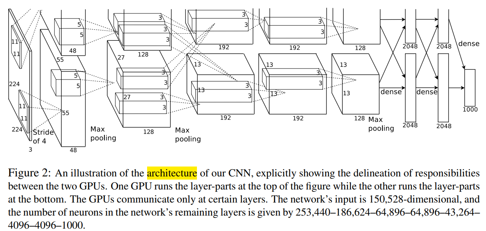

### VGG

* 创新
  * 仅仅使用3x3 卷积核，作者认为组合2个 3x3 卷积层和5x5核具有一样的感受野。这使得卷积核尺寸表现，感受野不变。一个好处是减少了参数量。
  * 随着输入空间尺寸的变小，通道数不断加大
  * 每次池化之后都是用多个卷积层，这诠释了空间尺度缩小的时候，深度加深。
  * 在训练过程中使用scale jittering作为一种数据增强技术。
  * 使用每个卷积层后使用ReLU层并且通过 batch gradient descent训练。

* 网络结构

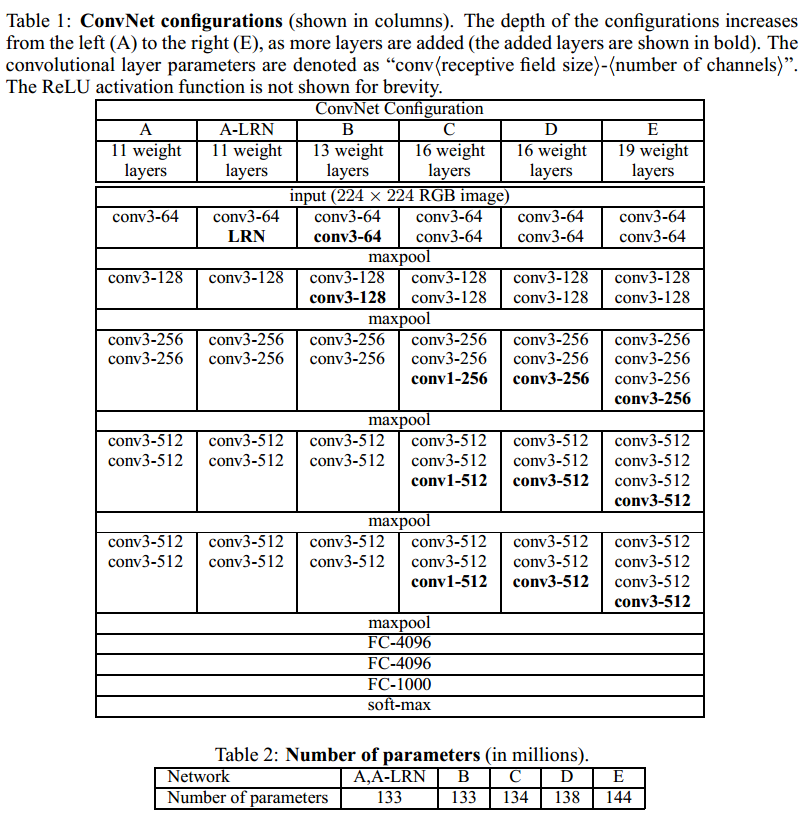

### Network in Network

* 创新
  * 利用全局池化代替全连接
    * 目的是生成一张特征图为每个类别，
    * 每张特征图对应一个类别，更好的可解释性，
    * 没有需要优化的参数，避免了这一层的过拟合。
  * 1x1 的卷积网络具有减少深度的作用；
  * 1x1卷积是线性的，但是后面一般都会接一个ReLU非线性激活单元。

* 网络结构

### [v1] Going Deeper with Convolutions

* 创新
  * 第一个只是使用卷积和池化的堆叠的网络。
  * 使用9个Inception modules在整个网络中，超过100层.
  * 没有使用全连接层，使用全局平均池化将7x7x1024 volume到1x1x1024 volume. 节省了大量的参数。
  * 测试阶段, 使用multiple crops在一张图片上，softmax probabilities是平均值.

* 结构

### [v2] Batch Normalization:Accelerating Deep Network Training by Reducing Internal Covariate Shift

* 创新
    1. 可以使用更高的学习率。如果每层的scale不一致，实际上每层需要的学习率是不一样的，同一层不同维度的scale往往也需要不同大小的学习率，通常需要使用最小的那个学习率才能保证损失函数有效下降，Batch Normalization将每层、每维的scale保持一致，那么我们就可以直接使用较高的学习率进行优化。
    2. 移除或使用较低的dropout。 dropout是常用的防止overfitting的方法，而导致overfit的位置往往在数据边界处，如果初始化权重就已经落在数据内部，overfit现象就可以得到一定的缓解。论文中最后的模型分别使用10%、5%和0%的dropout训练模型，与之前的40%-50%相比，可以大大提高训练速度。
* 为什么需要BN：
  - 归一化：
    - 原因在于神经网络学习过程本质就是为了学习数据分布，一旦训练数据与测试数据的分布不同，那么网络的泛化能力也大大降低；
    - 一旦每批训练数据的分布各不相同，那么网络就要在每次迭代都去学习适应不同的分布，这样将会大大降低网络的训练速度；
  - 传递性
    - 网络的前面几层发生微小的改变，那么后面几层就会被累积放大下去。
    - 一旦网络某一层的输入数据的分布发生改变，那么这一层网络就需要去适应学习这个新的数据分布，所以如果训练过程中，
      训练数据的分布一直在发生变化，那么将会影响网络的训练速度。

* 算法

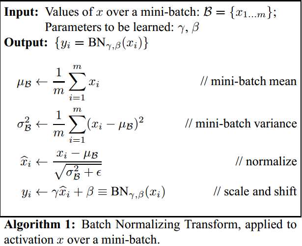

### [v3] Rethinking theInception Architecture for Computer Vision

* 创新
    1. 分解大filters，使其小型化、多层化，其中有个“非对称卷积”很新颖
    2. 优化inception v1的auxiliary classifiers
    3. 提出一种缩小特征图大小的方法，说白了就是一种新的、更复杂的pooling层
    4. Label smooth，“标签平滑”，很难用中文说清楚的一种方法

* Szegedy还把一段时间内的科研心得总结了一下，在论文里写了4项网络设计基本原则：
    1. 尽量避免representational bottlenecks，这种情况一般发生在pooling层，字面意思是，pooling后特征图变小了，
    但有用信息不能丢，不能因为网络的漏斗形结构而产生表达瓶颈，解决办法是上面提到的贡献3
    2. 采用更高维的表示方法能够更容易的处理网络的局部信息，我承认前面那句话是我硬翻译的，principle 2我确实不太明白
    3. 把大的filters拆成几个小filters叠加，不会降低网络的识别能力，对应上面的贡献1
    4. 把握好网络深度和宽度的平衡，这个原则说了等于没说

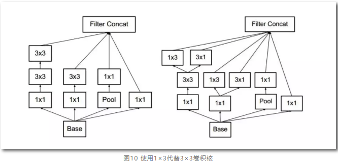

### Highway Networks 

- 前馈过程

  

- 反向传播

  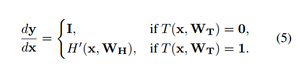

### ResNet

* 创新
  * 残差网络借鉴了高速网络（Highway Network）的跨层链接思想，但对其进行改进（残差项原本是带权值的，但ResNet用恒等映射代替之）。假定某段神经网络的输入是x，期望输出是H(x)，即H(x)是期望的复杂潜在映射，如果是要学习这样的模型，则训练难度会比较大；回想前面的假设，如果已经学习到较饱和的准确率（或者当发现下层的误差变大时），那么接下来的学习目标就转变为恒等映射的学习，也就是使输入x近似于输出H(x)，以保持在后面的层次中不会造成精度下降。
  * 在残差网络结构图中，通过“shortcut connections（捷径连接）”的方式，直接把输入x传到输出作为初始结果，输出结果为H(x)=F(x)+x，当F(x)=0时，那么H(x)=x，也就是上面所提到的恒等映射。于是，ResNet相当于将学习目标改变了，不再是学习一个完整的输出，而是目标值H(X)和x的差值，也就是所谓的残差F(x) := H(x)-x，因此，后面的训练目标就是要将残差结果逼近于0，使到随着网络加深，准确率不下降。这种残差跳跃式的结构，打破了传统的神经网络n-1层的输出只能给n层作为输入的惯例，使某一层的输出可以直接跨过几层作为后面某一层的输入，其意义在于为叠加多层网络而使得整个学习模型的错误率不降反升的难题提供了新的方向。至此，神经网络的层数可以超越之前的约束，达到几十层、上百层甚至千层，为高级语义特征提取和分类提供了可行性。
* 残差结构

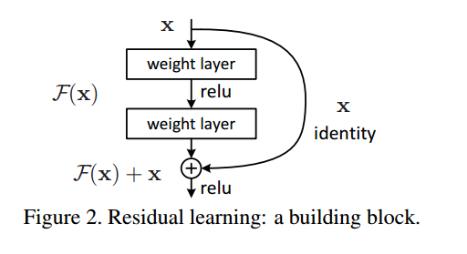

* 学习函数的不同

  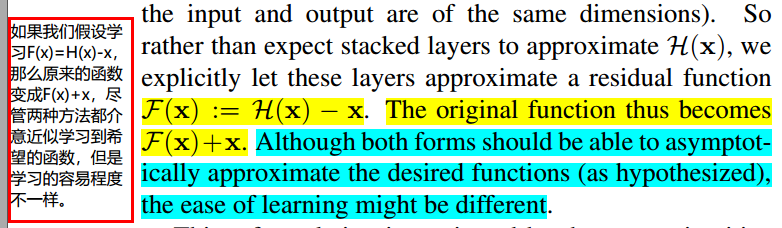

* **为什么恒等映射**：退化问题表明求解器可能难以通过多个非线性层逼近恒等映射。 利用残差学习重构，如果恒等映射是最优的，则求解器可以简单地将多个非线性层的权重推向零以接近恒等映射。

  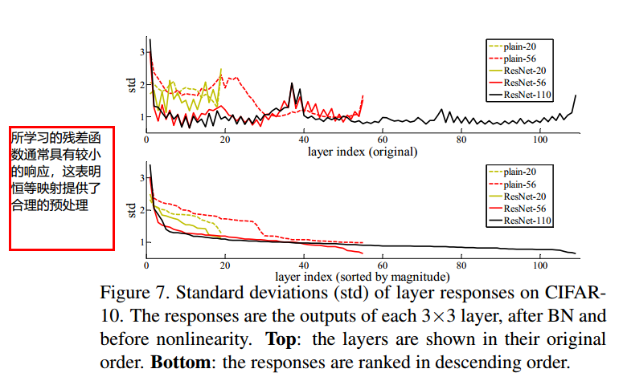

* 对于其他形式的映射关系，不需要

  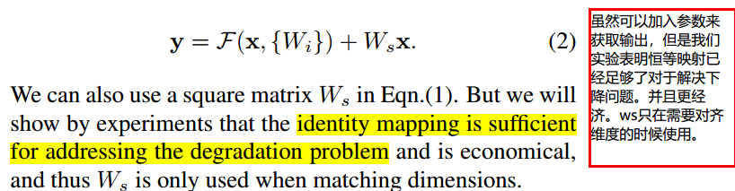

### DensNet

### 创新：

* 减少了梯度消失问题，增强了特征图，鼓励特征的重用；
  * 发现在训练过程中的每一步都随机地扔掉（drop）一些层，可以显著的提高 ResNet 的泛化性能。这个方法的成功带来以下两点启发：
    1. 它说明了神经网络其实并不一定要是一个递进层级结构，也就是说网络中的某一层可以不仅仅依赖于紧邻的上一层的特征，还可以依赖于更前面层学习的特征。想像一下在随机深度网络中，当第 l 层被扔掉后，第 L+1 层就被直接连到了第 L-1 层；当第 2 到了第 L 层都被扔掉之后，第 L+1 层就直接用到了第 1 层的特征。因此，随机深度网络其实可以看成一个具有随机密集连接的 DenseNet。
    2. 在训练的过程中随机扔掉很多层也不会破坏算法的收敛，说明了 ResNet 具有比较明显的冗余性，网络中的每一层都只提取了很少的特征（即所谓的残差）。实际上，将训练好的 ResNet 随机的去掉几层，对网络的预测结果也不会产生太大的影响。既然每一层学习的特征这么少，能不能降低它的计算量来减小冗余呢？

- DenseNet 的设计正是基于以上两点观察。让网络中的每一层都直接与其前面层相连，实现特征的重复利用；同时把网络的每一层设计得特别窄，即只学习非常少的特征图（最极端情况就是每一层只学习一个特征图），达到降低冗余性的目的。这两点也是 DenseNet 与其他网络最主要的不同。需要强调的是，第一点是第二点的前提，没有密集连接，就不可能把网络设计得太窄，否则训练会出现欠拟合现象，即使 ResNet 也是如此。

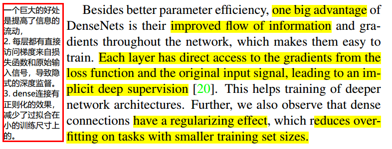

* densenet提高准确率：
  * 单独的层接受了额外的附加的来自跳跃连接损失函数的监督信息;

  * densenet实现了相似的监督信息：一个单一的分类的器提供直接的监督信息给所有的层，然而损失函数和梯度不复杂，损失函数在所有层共享。

### 网络结构

* 网络结构：不是ResNet一样，相加相融合，我们采用堆叠的方式融合特征。

  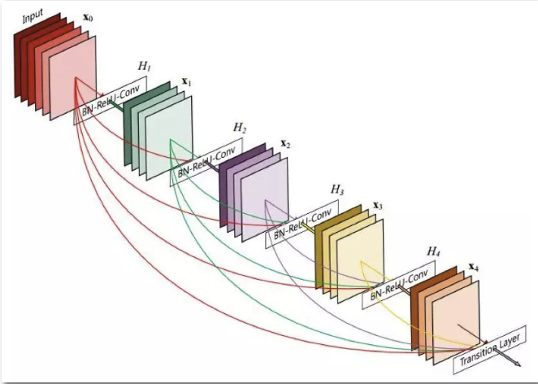

* ResNets的一个优点是可以直接将梯度从后层传向前层。然而，自身与经过转换得到的输出是通过求和的形式来连接的，这可能使网络中信息的传播受到影响。

  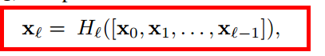

* 网络的整体结构，因为有了pooling层，会使得输出尺寸变小；

  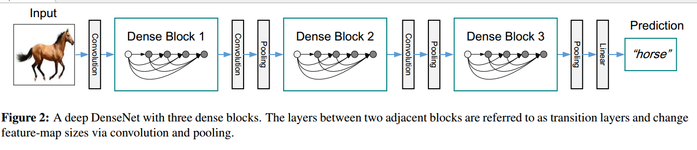

  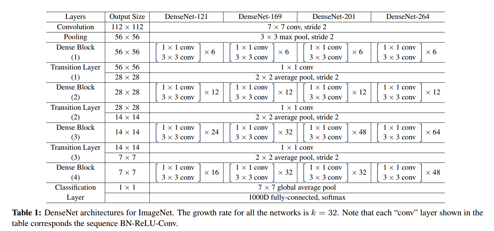

### Squeeze-and-Excitation Networks（SENet）

* 创新
  * Excitation部分是用个全连接来实现 ，第一个全连接把C个通道压缩成了C/r个通道来降低计算量（后面跟了RELU），第二个全连接再恢复回C个通道（后面跟了Sigmoid），r是指压缩的比例。作者尝试了r在各种取值下的性能 ，最后得出结论r=16时整体性能和计算量最平衡。
  * 为什么要加全连接层呢？这是为了利用通道间的相关性来训练出真正的scale。一次mini-batch个样本的squeeze输出并不代表通道真实要调整的scale值，真实的scale要基于全部数据集来训练得出，而不是基于单个batch，所以后面要加个全连接层来进行训练。可以拿SE Block和下面3种错误的结构比较来进一步理解：图最上方的结构，squeeze的输出直接scale到输入上，没有了全连接层，某个通道的调整值完全基于单个通道GAP的结果，事实上只有GAP的分支是完全没有反向计算、没有训练的过程的，就无法基于全部数据集来训练得出通道增强、减弱的规律。
  * 图中间是经典的卷积结构，有人会说卷积训练出的权值就含有了scale的成分在里面，也利用了通道间的相关性，为啥还要多个SE Block？那是因为这种卷积有空间的成分在里面，为了排除空间上的干扰就得先用GAP压缩成一个点后再作卷积，压缩后因为没有了Height、Width的成分，这种卷积就是全连接了。
    图最下面的结构，SE模块和传统的卷积间采用并联而不是串联的方式，这时SE利用的是Ftr输入X的相关性来计算scale，X和U的相关性是不同的，把根据X的相关性计算出的scale应用到U上明显不合适。

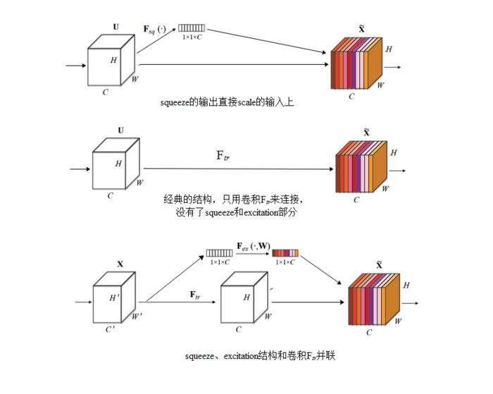

- 模块结构

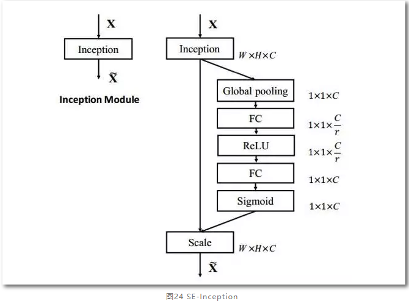

