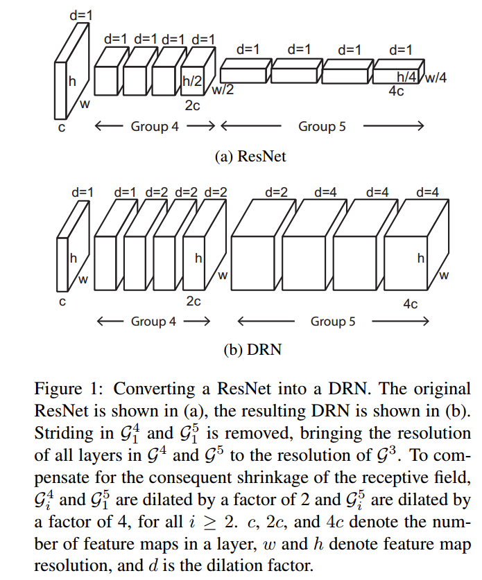

* [paper](paper/2017-Dilated%20Residual%20Networks.pdf)

### 体会

* 感觉这篇文章的关键不是idea，而是写法；
* 通过实验和公式说明了这样组合的优势；

### 动机

* 之前的卷积神经网络都是通过不断降低图像精度，直到图像被一个仅保留微弱空间信息的特征map表示（一般最后卷积层输出仅为7×7），最后通过计算类别概率来分类图像。这样情况下，尽管前面卷积网络做的很好，但是整个网络却不能获取一个十分精确的结果，例如一个很小的目标对解析图片信息十分重要，但是却被前面卷积网络因为过多降维和其体积很小而直接忽略掉了。 
* 图像分类的深度网络大多数还作为其他需要更多详细场景理解的任务的预训练模型，而很高的**空间分辨率损失**对这些任务而言是非常不利的。 

* 所以卷积神经网络应用在图像分类中，**维护图片空间一定的分辨率**是一个很重要的任务。现有算法有以下的做法： up-convolutions，skip connections 和 other post-hoc measures。 

### 贡献

* 但是上面的方法会造成图片变形，所以本文提出使用Dilated Convolutions方法来解决这个问题。Dilated Convolutions的好处就是既能保持原有网络的感受野（Receptive Field），同时又不会损失图像空间的分辨率（224×224输入的最后卷积层输出特征map是28×28）。

### 网络结构

* 与ResNet相比：

