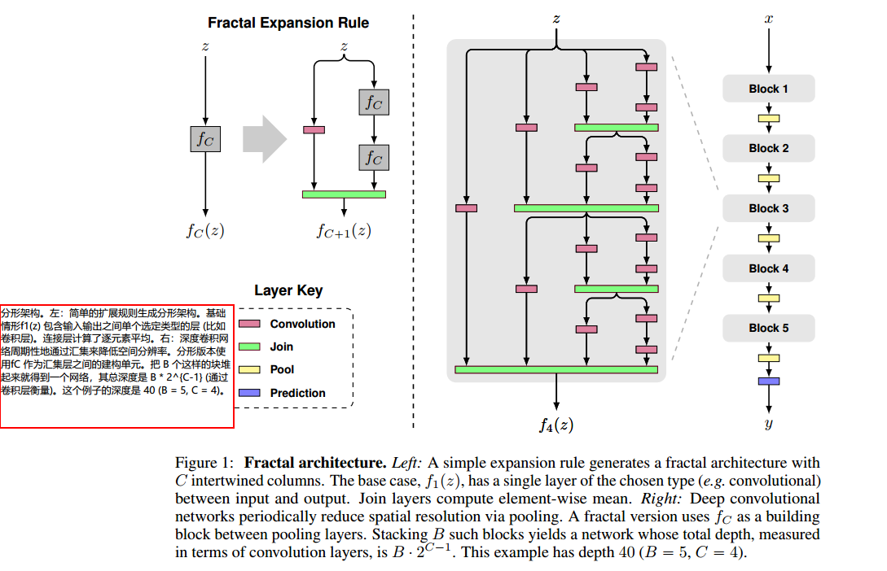
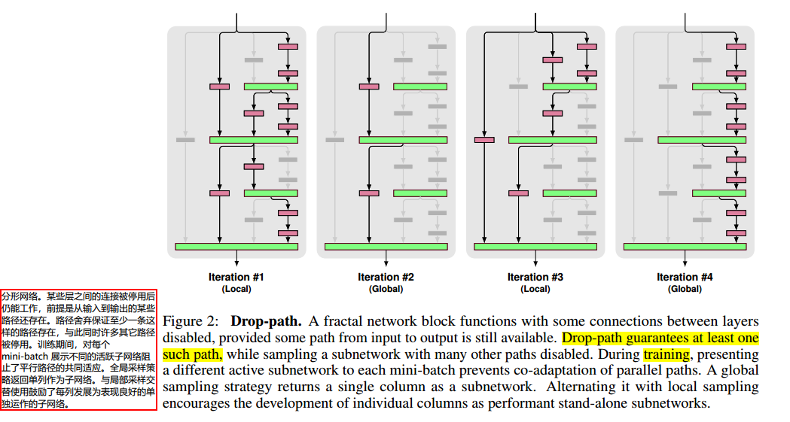
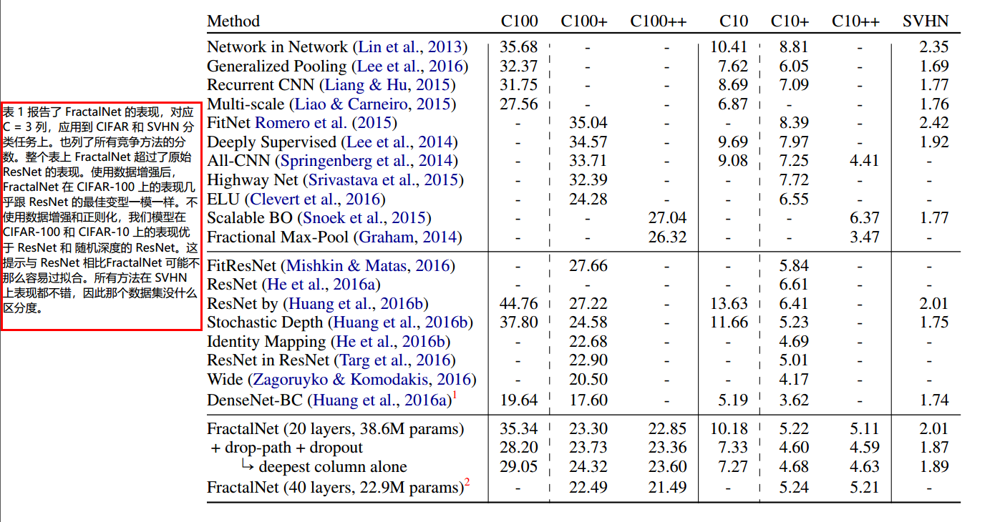
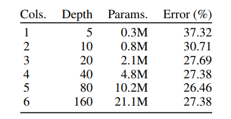
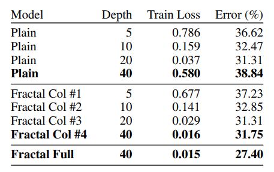
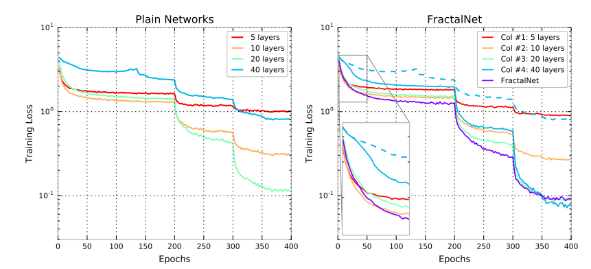

* [paper](paper/2017-FractalNet-%20Ultra-Deep%20Neural%20Networks%20without%20Residuals.pdf)
* [基于分形结构的极深神经网络，超越 ImageNet 2015 冠军 ResNet（附论文下载）](https://www.toutiao.com/i6290496834213249537/)
* [code](https://github.com/jiye-ML/Classify_FRACTALNET.git)

> 关键在于正则化功能，

### **文章提出了什么（What）**

* ResNet提升了深度网络的表现，本文提出的分形网络也取得了优秀的表现，通过实验表示，残差结构对于深度网络来说不是必须的。

* ResNet缺乏正则方法，本文提出了drop-path，对子路径进行随机丢弃

### **为什么有效（Why）**

1. 分形网络不像resNet那样连一条捷径，而是通过不同长度的子路径组合，网络选择合适的子路径集合提升模型表现
2. drop-path是dropout（防止co-adaption）的天然扩展，是一种正则方法，可以防止过拟合，提升模型表现
3. drop-path提供了很好的正则效果，在不用数据增强时也取得了优秀的结果
4. 通过实验说明了带drop-path训练后的总网络提取的单独列（网络）也能取得优秀的表现。
5. 分形网络体现的一种特性为：浅层子网提供更迅速的回答，深层子网提供更准确的回答。

### 分形网络是怎么做的（How）

#### **两种drop-path**

* 正如dropout阻止了激活的相互依赖一样，drop-path通过随机drop连接层的操作数来防止并行路径的相互依赖。这不鼓励网络使用一个输入路径作为锚点而另一个输入路径作为校正术语（否则会过拟合）
* 我们考虑采用以下策略
  1. Local：对join层的输入dropout，但是至少保证要有一个输入；join(绿色部分)
  2. Global: 对于整个网络来说，只选择一条路径，且限制为某个单独列，所以这条路径是独立的强预测路径；

### 实验训练的时候

* **模型对比的实验**

  

  1. +表示使用了水平镜像翻转和平移，++表示使用了更多的数据增强，实验主要和ResNet对比
  2. 用drop-path训练，可以从网络提取最深的单独列，在表格数据中可以看出也取得了不错的表现
  3. 不使用数据增强时，分形网络的表现超过了ResNet，可以看出分形网络更不容易过拟合
  4. 使用数据增强时，分形网络取得了和ResNet变种差不多的表现
  5. 不使用数据增强的时候，drop-path提升了表现
  6. 使用数据增强的时候，drop-path提升或者没有下降太大的表现

#### **20层分形网络的模型细节**

1. 每个卷积层后面加了BN（先卷积，再BN，再relu激活）
2. B=5，C=3
3. 训练集都是`32*32*3`的图像，使用2*2的Max-pooling，经过5次下采样后32*32会变成`1*1`，最后的预测层使用softmax
4. 为了实现方便，对于每一个block，调换了最后面的pool和join的顺序
5. 五个block的卷积核数量默认为64，128，256，512，512
6. 每个block最后的dropout概率设为0，0.1，0.2，0.3，0.4
7. 整个网络的local drop-path设为0.15
8. caffe实现，学习率为0.02，momentum为0.9，batchsize为100，使用Xavier初始化参数
9. CIFAR-10/CIFAR-100迭代了400轮，SVHN迭代了20轮
10. 每当“剩余epoch数减半”时，学习率除以10（比如剩余epoch为200时，剩余epoch为100时，剩余epoch为50时候）

#### **其它实验**

1. 分形网络到了160层开始出现退化
2. 平常的网络到了40层就出现了退化，到了160层不能收敛
3. 使用了drop-path的分形网络提取的单独列（网络）比平常的网络取得了更优的表现，而且克服了退化问题（平常网络40层就退化）
4. 这里的实验减小了每个block的channels，为16，32，64，128，128，batchsize设置为50

### **学习曲线**

1. 40层分形网络的学习曲线中，可以看到Col#4 开始学习时很慢，当其它子网学习趋近稳定时，Col#4学习速度提升
2. 左图平常网络的学习曲线中没有这种性质（蓝色虚线）
3. 假设分形网络会触发和深度监督，横向的“学生-教师”信息流类似的效果，那么可以这样分析，当分形网络依赖于单独使用Col#3来输出，当drop-path丢弃Col#3的时候，网络则会促进Col#4的学习，使得Col#4学的东西能代替Col#3，这是一个迷你的学生-教师问题

### **总结**

1. 论文的实验说明了路径长度才是训练深度网络的需要的基本组件，而不单单是残差块

2. 分形网络和残差网络都有很大的网络深度，但是在训练的时候都具有更短的有效的梯度传播路径

3. 分形网络简化了对这种需求（更短的有效的梯度传播路径）的满足，可以防止网络过深

4. 多余的深度可能会减慢训练速度，但不会损害准确性
