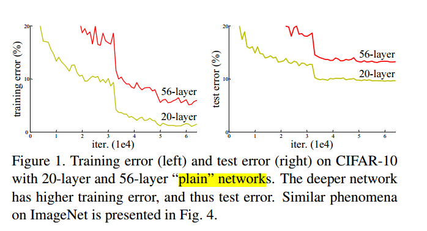

## 4. ResNet

* [大话深度残差网络（DRN）ResNet网络原理](https://my.oschina.net/u/876354/blog/1622896)

## 《Identity mappings in deep residual networks》

* [paper](paper/2016-Identity%20Mappings%20in%20Deep%20Residual%20Networks.pdf)
* [【一个神经元统治一切】ResNet 强大的理论证明](https://mp.weixin.qq.com/s/xTJr-jWMjk73TCZ8gBT4Ww)
* [何恺明CVPR演讲：深入理解ResNet和视觉识别的表示学习（41 PPT）](https://mp.weixin.qq.com/s/Wmj0dkHA93RCWB10lUcgmw)

##《Deep Residual Learning for Image Recognition 》

* [paper](paper/2015-Deep%20Residual%20Learning%20for%20Image%20Recognition.pdf)
* [github code](ResNet.py)

### 论文阅读

* 仅仅加深深度在普通的网络上的表现

  

* 获得更好的网络的办法是队列更多的层吗？回答这个问题的一个障碍是消失/爆炸梯度的臭名昭着的问题，从一开始就阻碍了融合。

* 残差网络模块

* 学习函数的不同

  

* **为什么恒等映射**：退化问题表明求解器可能难以通过多个非线性层逼近恒等映射。 利用残差学习重构，如果恒等映射是最优的，则求解器可以简单地将多个非线性层的权重推向零以接近恒等映射。

  

* 对于其他形式的映射关系，不需要

  

## DenseNet

- Densely Connected Convolutional Networks
- 发现在训练过程中的每一步都随机地扔掉（drop）一些层，可以显著的提高 ResNet 的泛化性能。这个方法的成功带来以下两点启发：
  1. 它说明了神经网络其实并不一定要是一个递进层级结构，也就是说网络中的某一层可以不仅仅依赖于紧邻的上一层的特征，
     还可以依赖于更前面层学习的特征。想像一下在随机深度网络中，当第 l 层被扔掉之后，第 L+1 层就被直接连到了第 L-1 层；
     当第 2 到了第 L 层都被扔掉之后，第 L+1 层就直接用到了第 1 层的特征。
     因此，随机深度网络其实可以看成一个具有随机密集连接的 DenseNet。
  2. 在训练的过程中随机扔掉很多层也不会破坏算法的收敛，说明了 ResNet 具有比较明显的冗余性，
     网络中的每一层都只提取了很少的特征（即所谓的残差）。实际上，将训练好的 ResNet 随机的去掉几层，
     对网络的预测结果也不会产生太大的影响。既然每一层学习的特征这么少，能不能降低它的计算量来减小冗余呢？
- DenseNet 的设计正是基于以上两点观察。让网络中的每一层都直接与其前面层相连，实现特征的重复利用；
  同时把网络的每一层设计得特别窄，即只学习非常少的特征图（最极端情况就是每一层只学习一个特征图），
  达到降低冗余性的目的。这两点也是 DenseNet 与其他网络最主要的不同。需要强调的是，
  第一点是第二点的前提，没有密集连接，就不可能把网络设计得太窄，否则训练会出现欠拟合现象，即使 ResNet 也是如此。

- 上图是一个详细的Dense Block的模拟，其中层数为5，即具有5个BN+Relu+Conv(3 * 3)这样的layer，网络增长率k为4，
  简单的说就是每一个layer输出的feature map的维度为k。即：第L层网络的输入为k × (L- 1) + k0 ，
  这里的k0为原始输入的通道数，然后把k × (L- 1) + k0降维为k，再把这个k加上前面所有的连接作为L+1层的输入，
  即第L+1层网络的输入为k× L + k0。由于DenseNet的每一个Dense Block模块都利用到了该模块中前面所有层的信息，
  即每一个layer都和前面的layer有highway的稠密连接。假设一个具有L层的网络，那么highway稠密连接数目为L*(L+1)/2。
  和Resnet不同的是，这里的连接方式得到的feature map做的是concat操作，而resnet中做的是elementwise操作。
- 作者在论文中提出的DenseNet的网络结构为：
  1. 三个block，每一个block具有相等个数的layers，如下图所示；
     
  2. 所有卷积层都使用3×3的卷积核；
  3. 用zeros-padding和2×2的average pooling来调整feature map的大小使之固定到同一尺寸；
  4. 最后一个block的输出后面接一个全局average pooling和一个softmax 分类器；
  5. feature map 的尺寸在三个block里面分别为32× 32、16×16、8×8；
  6. 网络增长率k和block里面的layers层数有两种方案：k = 12，L=40, 以及k = 24，L=100。

## SENet 《Squeeze-and-Excitation Networks》

- SENet是基于特征通道之间的关系提出的，下图是SENet的Block单元，图中的Ftr是传统的卷积结构，X和U是Ftr的输入和输出，这些都是以往结构中已存在的。SENet增加的部分是U后的结构：对U先做一个Global Average Pooling（称为Squeeze过程），输出是一个1x1xC的数据，再经过两级全连接（称为Excitation过程），最后用sigmoid把输出限制到[0，1]的范围，把这个值作为scale再乘到U的C个通道上，作为下一级的输入数据。这种结构的原理是想**通过控制scale的大小，把重要的特征增强，不重要的特征减弱，从而让提取的特征指向性更强。**
- 下图是把SENet模型分别用于Inception网络和ResNet网络，下图左边部分是原始网络，右边部分是加了SENet之后的网络，分别变成SE-Inception和SE-ResNet。网络中的r是压缩参数，先通过第一个全连接层把1x1xC的数据压缩为1x1xC/r，再通过第二个全连接层把数据扩展到1x1xC。 

