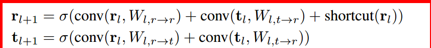
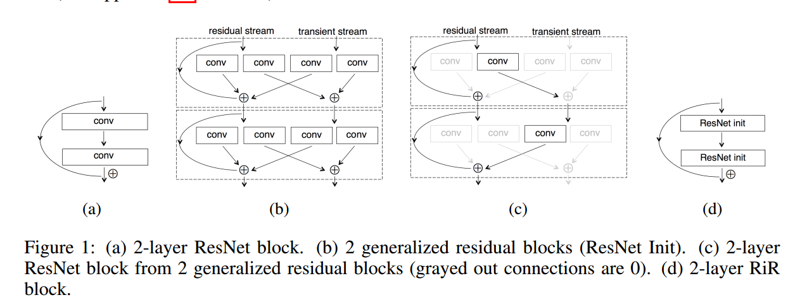

## 2016-Resnet in Resnet- Generalizing Residual Architectures
* [paper](paper/2016-Resnet%20in%20Resnet-%20Generalizing%20Residual%20Architectures.pdf)

### 动机

* ResNet结构有一些潜在的限制
  * 在每一层堆积前面层的特征，一些特征在后面层的学习中不在提供有用的信息。
* 我们介绍一种广义的残差结构，组合残差网络和标准的卷积网络以并行残差和没有残差流的方式。我们表明使用广义残差块保留了identity shortcut连接的优化特性，同时提高了表达能力、降低了去除不需要的信息的难度。

### 结构

* 学习两个函数
  * 和ResNet一样的包含恒等映射的网络
  * 一个传输流，而瞬态流t增加了以非线性方式处理来自任一流的信息而没有快捷方式连接的能力，允许丢弃来自先前状态的信息。

* 两个结果之后summed，在BN和ReLU等操作之前，

* 一个block和复数卷积优点类似。

