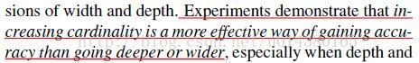
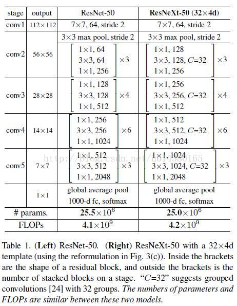
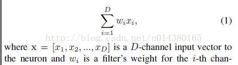
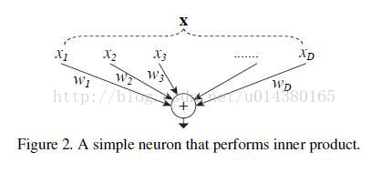
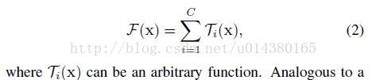
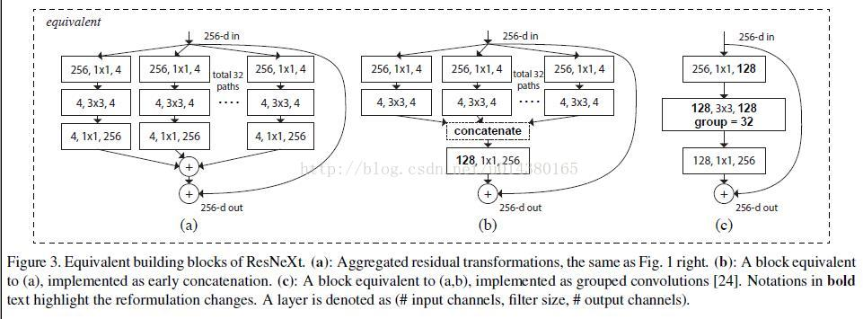

* [paper](paper/2017-Aggregated%20Residual%20Transformations%20for%20Deep%20Neural%20Networks.pdf)
* [如何评价谷歌的xception网络？](https://www.zhihu.com/question/62478193)

### 动机

* 传统的要提高模型的准确率，都是加深或加宽网络，但是随着超参数数量的增加（比如channels数，filter size等等），网络设计的难度和计算开销也会增加。
* 本文提出的 ResNeXt 结构可以在不增加参数复杂度的前提下提高准确率，同时还减少了超参数的数量；

### 贡献

* 作者在这篇论文中提出网络 ResNeXt，同时采用 VGG 堆叠的思想和 Inception 的 split-transform-merge 思想，但是可扩展性比较强，可以认为是在增加准确率的同时基本不改变或降低模型的复杂度。这里提到一个名词cardinality，原文的解释是the size of the set of transformations，如下图 Fig1 右边是 cardinality=32 的样子，这里注意每个被聚合的拓扑结构都是一样的(这也是和 Inception 的差别，减轻设计负担)

* 附上原文比较核心的一句话，点明了**增加 cardinality 比增加深度和宽度更有效**，这句话的实验结果在后面有展示：

### 网络结构

* Table1 列举了 ResNet-50 和 ResNeXt-50 的内部结构，另外最后两行说明二者之间的参数复杂度差别不大。

* 接下来作者要开始讲本文提出的新的 block，举全连接层（Inner product）的例子来讲，我们知道全连接层的就是以下这个公式：

* 再配上这个图就更容易理解其splitting，transforming和aggregating的过程。

* 然后作者的网络其实就是将其中的 wixi替换成更一般的函数，这里用了一个很形象的词：Network in Neuron，式子如下：（其中C就是 cardinality，Ti有相同的拓扑结构（本文中就是三个卷积层的堆叠）。）

* 然后看看fig 3。这里作者展示了三种相同的 ResNeXt blocks。fig3.a 就是前面所说的aggregated residual transformations。 fig3.b 则采用两层卷积后 concatenate，再卷积，有点类似 Inception-ResNet，只不过这里的 paths 都是相同的拓扑结构。fig 3.c采用的是grouped convolutions，这个 group 参数就是 caffe 的 convolusion 层的 group 参数，用来限制本层卷积核和输入 channels 的卷积，最早应该是 AlexNet 上使用，可以减少计算量。这里 fig 3.c 采用32个 group，每个 group 的输入输出 channels 都是4，最后把channels合并。这张图的 fig3.c 和 fig1 的左边图很像，差别在于fig3.c的中间 filter 数量（此处为128，而fig 1中为64）更多。作者在文中明确说明这三种结构是严格等价的，并且用这三个结构做出来的结果一模一样，在本文中展示的是 fig3.c 的结果，因为 fig3.c 的结构比较简洁而且速度更快。

