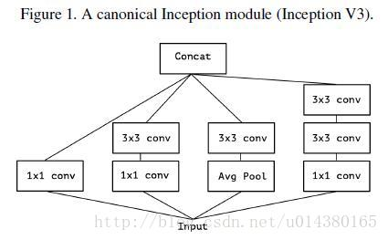
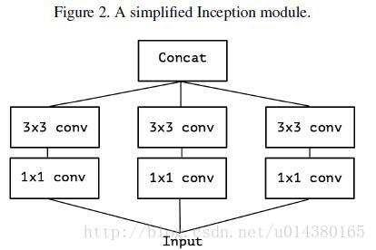
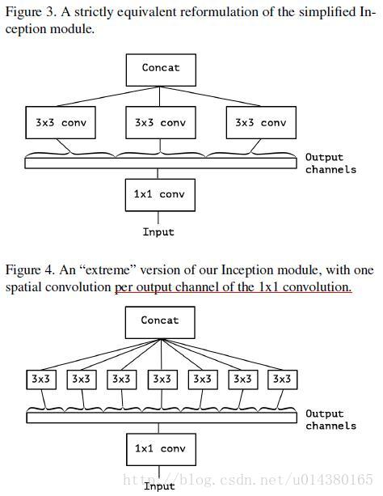
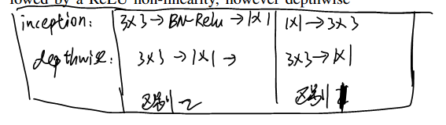
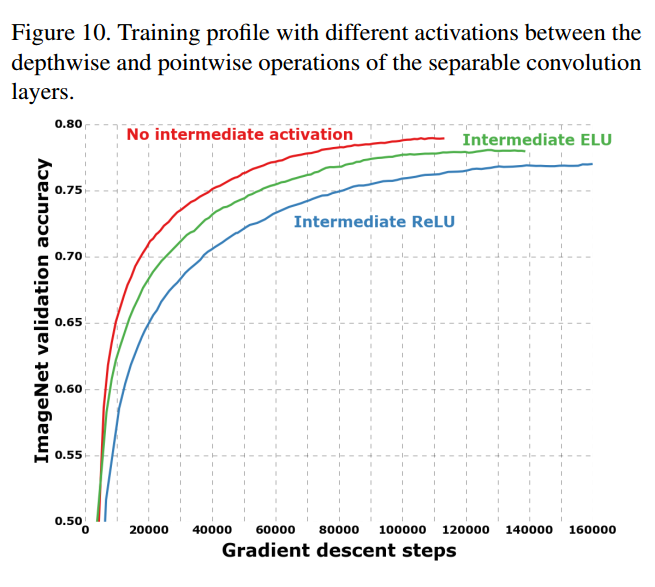
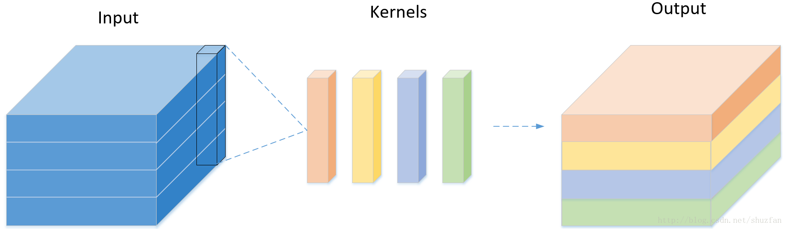
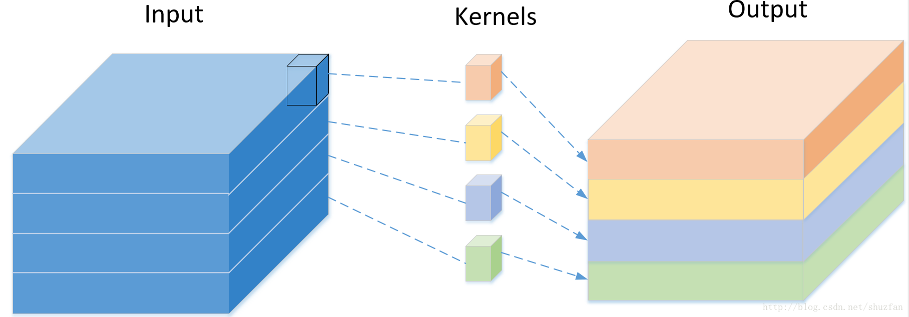
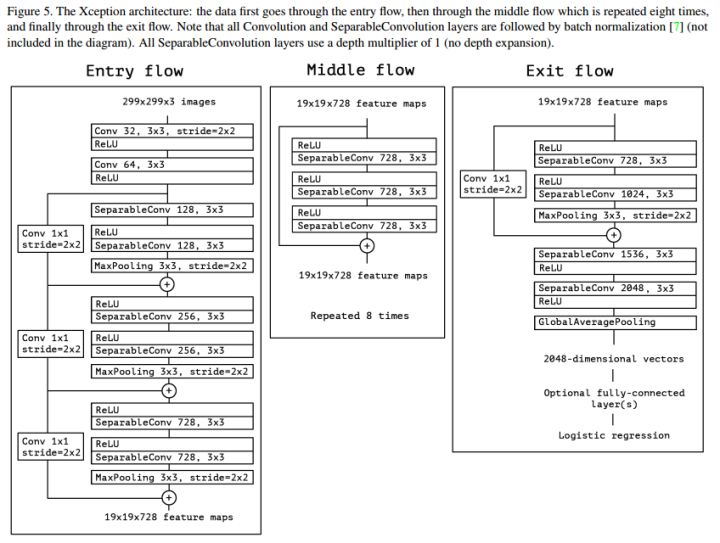

> 本论文追求的不是准确率的提高，而是不降低准确率的前提下，减少参数数量，寻找更有的结构；
>
> 这篇论文是不错的实验模仿对象，以后做实验可以按照本论文的思路探索；

* [paper](paper/2017-Xception%20Deep%20Learning%20with%20Depthwise%20Separable%20Convolutions.pdf)

### 动机

- 要解决什么问题？

- - 探寻Inception的基本思路，并将这种思路发扬光大。

- 用了什么方法解决？

- - 从Inception发展历程的角度，理解其基本思想，并引入与Inception类似的Depthwise Separable Convolution结构。
  - 将Inception V3结构中的Inception改用Depthwise Separable Convolution。

- 效果如何？

- - 在与Inception V3参数数量相差无几的情况下，在ImageNet上性能有略微上升，JFT上有明显提高。

- 还存在什么问题？

- - Depthwise Separable Convolution不一定就是最优结构，还有尚未探索、验证的相似结构。

### 假设

* corss-channels correlations 和 spatial correlations是分开学习的，而不是在某一个操作中共同学习的。

### 优势

* Xception是Inception家族中一员。

- Inception的优势：相比普通的卷积操作，Inception的表达能力更强。

> empirically appear to be capable of learning richer representations with less parameters.

- Inception的基本思想：“通道”之间的相关性 与 空间相关性 最好要分开处理

> cross-channel correlations and spatial correlations are sufficiently decoupled that it is preferable not to map them jointly.

### 方法

* Xception是google继Inception后提出的对Inception v3的另一种改进，主要是采用depthwise separable convolution来替换原来Inception v3中的卷积操作。

* 要介绍Xception的话，需要先从Inception讲起，Inception v3的结构图如下Figure1。当时提出Inception的初衷可以认为是：特征的提取和传递可以通过1x1卷积，3x3卷积，5x5卷积，pooling等，到底哪种才是最好的提取特征方式呢？Inception结构将这个疑问留给网络自己训练，也就是将一个输入同时输给这几种提取特征方式，然后做concat。Inception v3和Inception v1（googleNet）对比主要是将5x5卷积换成两个3x3卷积层的叠加。

 

* 于是从Inception v3联想到了一个简化的Inception结构，就是Figure 2

* 再将Figure2延伸，就有了Figure3，Figure3表示对于一个输入，先用一个统一的1x1卷积核卷积，然后连接3个3x3的卷积，这3个卷积操作只将前面1x1卷积结果中的一部分作为自己的输入（这里是将1/3channel作为每个3x3卷积的输入）。再从Figure3延伸就得到Figure4，也就是3x3卷积的个数和1x1卷积的输出channel个数一样，每个3x3卷积都是和1个输入chuannel做卷积。

#### Depthwise Separable Convolution 与 "extreme" version of Inception Module比较

- "extreme" version of Inception Module：具体操作过程可以参考上图。

- - 第一步：普通1x1卷积。
  - 第二步：对1x1卷积结果的每个channel，分别进行3x3卷积操作，并将结果concat。

- Depthwise Separable Convolution的结构在MobileNet V1中有详细介绍。

- - 第一步：depthwise卷积，对输入的每个channel，分别进行3x3卷积操作，并将结果concat。
  - 第二步：pointwise卷积，对depthwise卷积中的concat结果，进行1x1卷积操作。

- Depthwise Separable Convolution 与 "extreme" version of Inception Module的区别：

- - 操作循序不一致：Depthwise Separable Convolution先进行3x3卷积，再进行1x1卷积；Inception先进行1x1卷积，再进行3x3卷积。
  - 是否使用非线性激活操作：Inception中，两次卷积后都使用Relu；Depthwise Separable Convolution中，在depthwise卷积后一般不添加Relu。在本论文中，通过试验进行验证。具体原因在论文MobileNet V2中有解释。

* 下面图示方式给出两者差别

- 

* 差别二特别重要，

- 

### 网络结构

* 以前卷积方法

* depthwise 卷积方法

* 网络整体架构

### 总结

* 从实验结果来看， Xception在参数量上同Inception V3基本等同， 在Imagenet上的表现二者也很接近(另一个更大规模的Google私有数据集上，Xception的优势要稍微明显些)。
* 大规模使用Group操作，其实不利于矩阵层面的运算。即使可以减少参数，但不一定可以提高速度。
* Xception在性能上的提升比较有限，而且不能确定是否是ResNet结构带来的提升。

