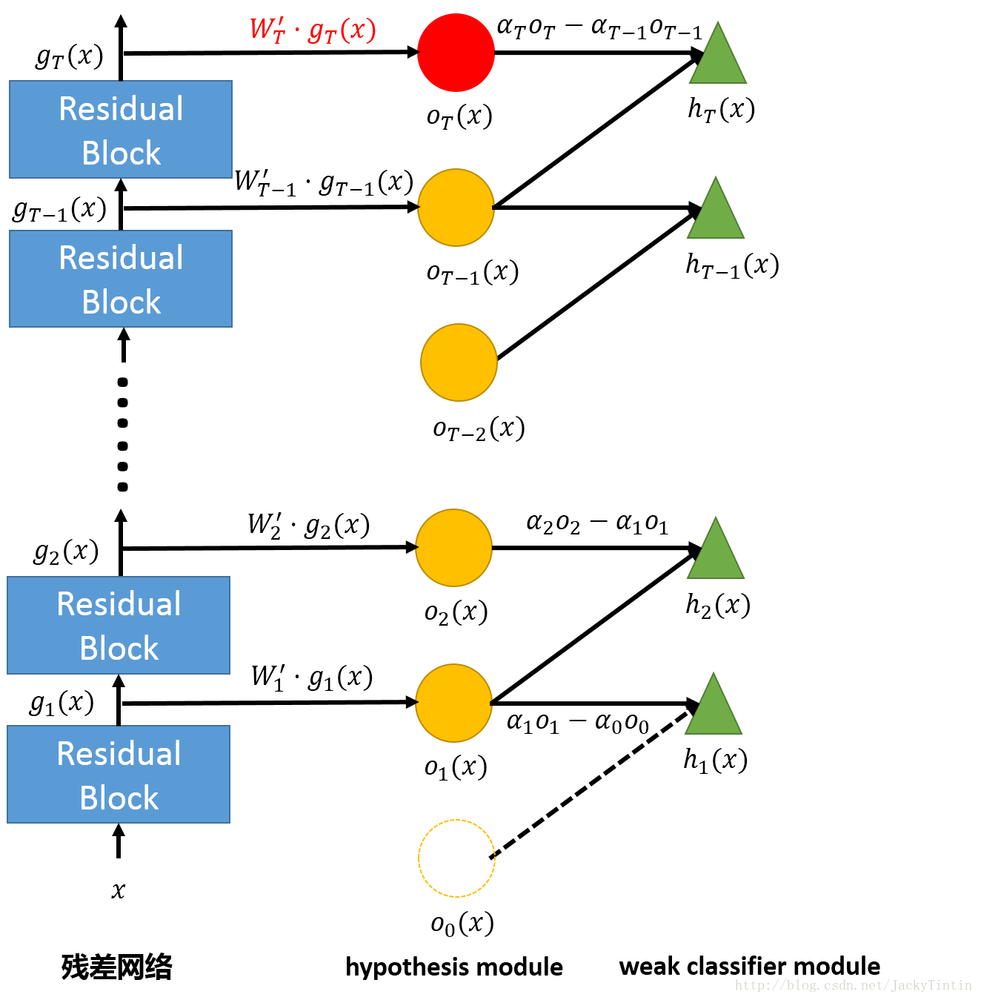
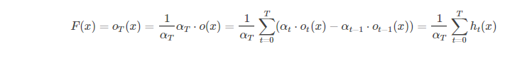
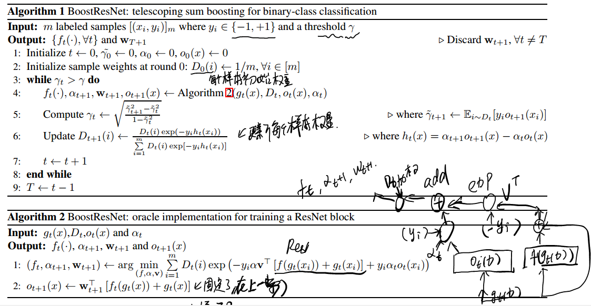

* [paper](paper/2018-Learning%20Deep%20ResNet%20Blocks%20Sequentially%20using%20Boosting%20Theory.pdf)
* 文章指出一种基于 boosting（提升）原理，逐层训练深度残差神经网络的方法，并对性能及泛化能力给出了理论上的证明
* [参考](https://blog.csdn.net/JackyTintin/article/details/73351199)

### 方法

* **框架**

* **残差网络**: 

  $$g_{t+1}(x)=f(g_{t}(x))+g_{t}(x)$$

* **hypothesis module**:  

  $$o_{t}(x)=softmax(W_{t}^{T}\cdot g_{t}(x))\epsilon R^{C}$$, 其中 CC 为分类任务的类别数。 即这是一个线性分类器（Logistic Regression）

* **weak module classifier**: 

  $$h_{t}(x)=α_{t+1}o_{t+1}(x)−α_{t}o_{t}(x)∈\epsilon R^{C}$$, 其中 α 为标量，也即 h 是相邻两层 hypothesis 的线性组合。第一层没有更低层，因此，可以视为有一个虚拟的低层，$α_{0}=0$ 并且 、$o_{0}(x)=0$.

* **将残差网络显示表示为 ensemble** :

  令残差网络的最后输出为 $F(x)$，并接合上述定义，显然有： 

  

  我们只需要逐级（residual block）训练残差网络，效果上便等同于训练了一系列弱分类的 enemble。其中，除了训练残差网络的权值外，还要训练一些辅助的参数——各层的 $α$及 $W$（训练完成后即可丢弃）。

#### Telescoping Sum Boosting（裂项求和提升）

* 文章正文以二分类问题为例展开，我们更关心多分类问题，相关算法在附录部分。文章给出的伪代码说明相当清楚，直接复制如下：

  

### 理论

* 作者证明了 BoostResNet 保留了 boost 算法是优点：
  1. 误差随网络深度（即弱分类器数量）指数减小；
  2. 抗过拟合性，模型复杂度承网络深度线性增长。详细可参见论文。

### 讨论

* BoostResNet 最大的特点是逐层训练，这样有一系列好处：
  * 减少内存占用（Memory Efficient），使得训练大型的深层网络成为可能。（目前我们也只能在 CIFAR 上训练千层的残差网络，过过干瘾）
  * 减少计算量（Computationally Efficient），每一级都只训练一个浅层模型。
  * 因为只需要训练浅层模型，在优化方法上可以有更多的选择（非 SGD 方法）。
  * 另外，网络层数可以依据训练情况动态的确定。

