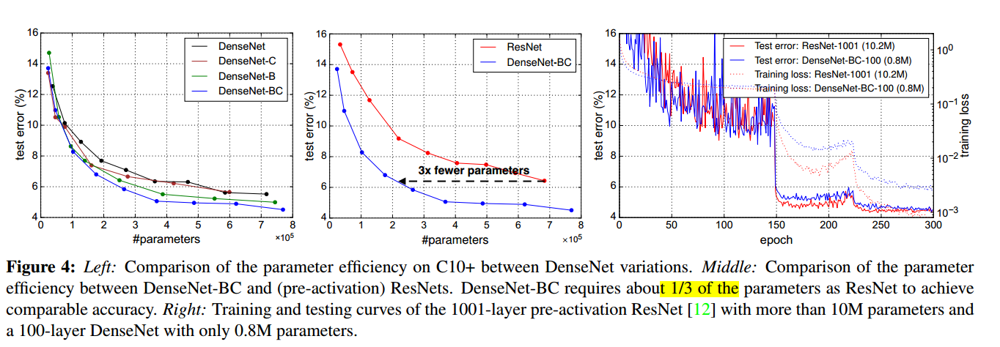
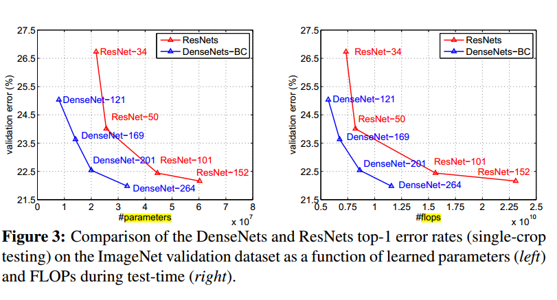
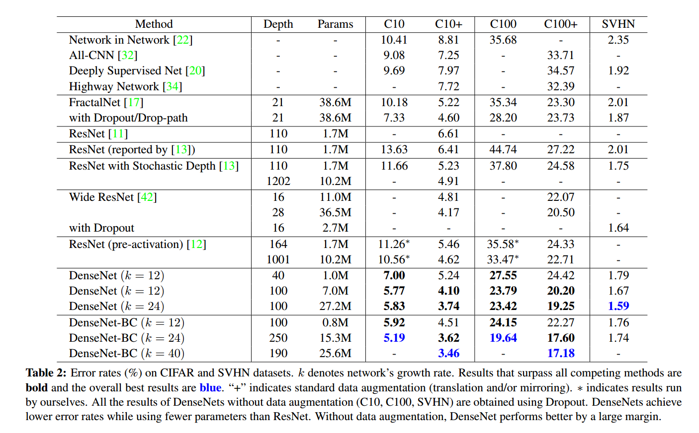

## 《Densely Connected Convolutional Networks》
* [paper](paper/2018-Densely%20Connected%20Convolutional%20Networks.pdf)

### 优点：

#### 1. 减少了梯度消失问题，增强了特征图，鼓励特征的重用；

* 发现在训练过程中的每一步都随机地扔掉（drop）一些层，可以显著的提高 ResNet 的泛化性能。这个方法的成功带来以下两点启发：
  1. 它说明了神经网络其实并不一定要是一个递进层级结构，也就是说网络中的某一层可以不仅仅依赖于紧邻的上一层的特征，还可以依赖于更前面层学习的特征。想像一下在随机深度网络中，当第 l 层被扔掉后，第 L+1 层就被直接连到了第 L-1 层；当第 2 到了第 L 层都被扔掉之后，第 L+1 层就直接用到了第 1 层的特征。因此，随机深度网络其实可以看成一个具有随机密集连接的 DenseNet。
  2. 在训练的过程中随机扔掉很多层也不会破坏算法的收敛，说明了 ResNet 具有比较明显的冗余性，网络中的每一层都只提取了很少的特征（即所谓的残差）。实际上，将训练好的 ResNet 随机的去掉几层，对网络的预测结果也不会产生太大的影响。既然每一层学习的特征这么少，能不能降低它的计算量来减小冗余呢？

- DenseNet 的设计正是基于以上两点观察。让网络中的每一层都直接与其前面层相连，实现特征的重复利用；同时把网络的每一层设计得特别窄，即只学习非常少的特征图（最极端情况就是每一层只学习一个特征图），达到降低冗余性的目的。这两点也是 DenseNet 与其他网络最主要的不同。需要强调的是，第一点是第二点的前提，没有密集连接，就不可能把网络设计得太窄，否则训练会出现欠拟合现象，即使 ResNet 也是如此。

#### 2. 计算量和参数量少：

- 达到相同效果下，densenet参数量1/3的ResNet

#### 3. densenet提高准确率：

* 单独的层接受了额外的附加的来自跳跃连接损失函数的监督信息;

* densenet实现了相似的监督信息：一个单一的分类的器提供直接的监督信息给所有的层，然而损失函数和梯度不复杂，损失函数在所有层共享。

### 网络结构

* 网络结构：不是ResNet一样，相加相融合，我们采用堆叠的方式融合特征。

  

* ResNets的一个优点是可以直接将梯度从后层传向前层。然而，自身与经过转换得到的输出是通过求和的形式来连接的，这可能使网络中信息的传播受到影响。

  

* 网络的整体结构，因为有了pooling层，会使得输出尺寸变小；

  

  

### 实验结果：

