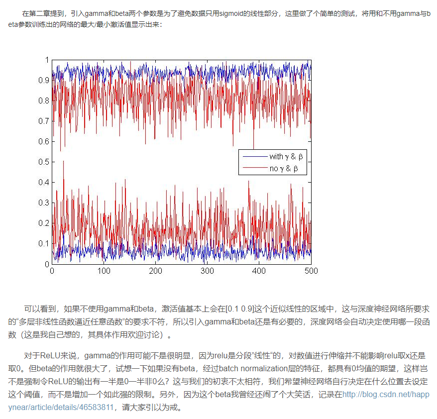

* [利用随机前馈神经网络生成图像观察网络复杂度](https://blog.csdn.net/happynear/article/details/46583811)
    * 用实验的方法解释了 BN中 连个参数都很重要。
    * 2维的数据点，由于图像数据的每一维一般都是0-255之间的数字，因此数据点只会落在第一象限，而且图像数据具有很强的相关性，
    比如第一个灰度值为30，比较黑，那它旁边的一个像素值一般不会超过100，否则给人的感觉就像噪声一样。
    由于强相关性，数据点仅会落在第一象限的很小的区域中，形成类似上图所示的狭长分布。
    * wx+b=0开始的时候表现为0附近的一条分割线，这样归一化数据可以带来计算量降低；
    * 而在RElu之后，数据也是在第一象限的，需要对数据进行归一化；使用BN；文章中说这样做在训练初期，分界面还在剧烈变化时，
    计算出的参数不稳定，所以退而求其次，在Wx+b之后进行归一化,先把输出利用BN拉到一定的返回再进行激活。
    因为初始的W是从标准高斯分布中采样得到的，而W中元素的数量远大于x，Wx+b每维的均值本身就接近0、方差接近1，
    所以在Wx+b后使用Batch Normalization能得到更稳定的结果。
    * 文中使用了类似z-score的归一化方式：每一维度减去自身均值，再除以自身标准差，由于使用的是随机梯度下降法，
    这些均值和方差也只能在当前迭代的batch中计算，故作者给这个算法命名为Batch Normalization。这里有一点需要注意，
    像卷积层这样具有权值共享的层，Wx+b的均值和方差是对整张map求得的，在batch_size * channel * height * width这么大的一层中，
    对总共batch_size * height * width个像素点统计得到一个均值和一个标准差，共得到channel组参数。
    * 引入gamma和beta两个参数是为了避免数据只用sigmoid的线性部分；其实如果是仅仅使用上面的归一化公式，
    对网络某一层A的输出数据做归一化，然后送入网络下一层B，这样是会影响到本层网络A所学习到的特征的。
    打个比方，比如我网络中间某一层学习到特征数据本身就分布在S型激活函数的两侧，你强制把它给我归一化处理、标准差也限制在了1，
    把数据变换成分布于s函数的中间部分，这样就相当于我这一层网络所学习到的特征分布被你搞坏了，变换重构，
    引入了可学习参数γ、β，这就是算法关键之处：因此我们引入了这个可学习重构参数γ、β，让我们的网络可以学习恢复出原始网络所要学习的特征分布。
    
    * 算法优势
        1. 可以使用更高的学习率。如果每层的scale不一致，实际上每层需要的学习率是不一样的，
        同一层不同维度的scale往往也需要不同大小的学习率，通常需要使用最小的那个学习率才能保证损失函数有效下降，
        Batch Normalization将每层、每维的scale保持一致，那么我们就可以直接使用较高的学习率进行优化。
        2. 移除或使用较低的dropout。 dropout是常用的防止overfitting的方法，而导致overfit的位置往往在数据边界处，
        如果初始化权重就已经落在数据内部，overfit现象就可以得到一定的缓解。论文中最后的模型分别使用10%、5%和0%的dropout训练模型，
        与之前的40%-50%相比，可以大大提高训练速度。