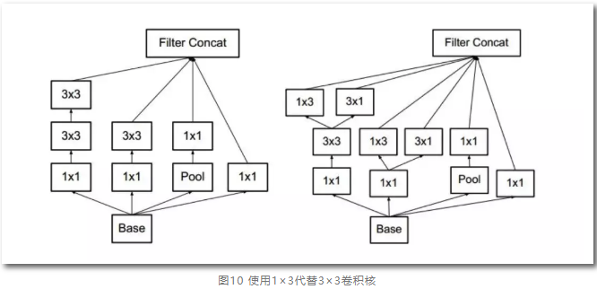

### [v3] Rethinking theInception Architecture for Computer Vision

* [paper](paper/21.300-15-Rethinking-the-Inception-Architecture-for-Computer-Vision.pdf)
    * 论文做出的贡献主要有4个
        1. 分解大filters，使其小型化、多层化，其中有个“非对称卷积”很新颖
        2. 优化inception v1的auxiliary classifiers
        3. 提出一种缩小特征图大小的方法，说白了就是一种新的、更复杂的pooling层
        4. Label smooth，“标签平滑”，很难用中文说清楚的一种方法
    
* Szegedy还把一段时间内的科研心得总结了一下，在论文里写了4项网络设计基本原则：
    1. 尽量避免representational bottlenecks，这种情况一般发生在pooling层，字面意思是，pooling后特征图变小了，
    但有用信息不能丢，不能因为网络的漏斗形结构而产生表达瓶颈，解决办法是上面提到的贡献3
    2. 采用更高维的表示方法能够更容易的处理网络的局部信息，我承认前面那句话是我硬翻译的，principle 2我确实不太明白
    3. 把大的filters拆成几个小filters叠加，不会降低网络的识别能力，对应上面的贡献1
    4. 把握好网络深度和宽度的平衡，这个原则说了等于没说

