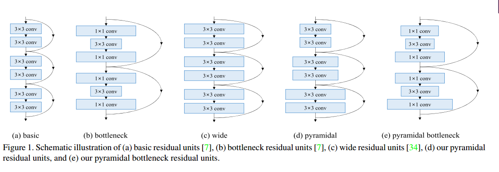
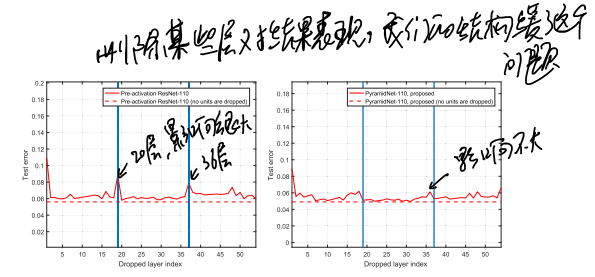
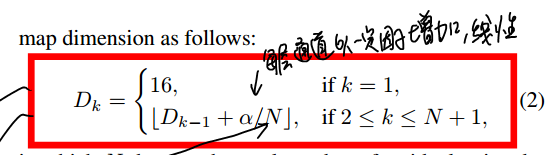
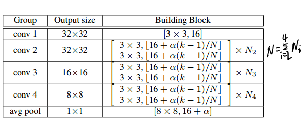
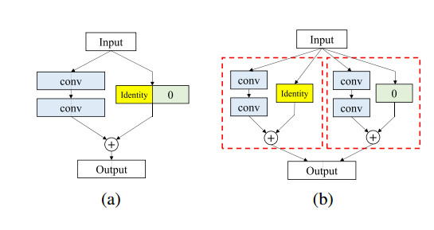

* [paper](paper/30.104-17-Deep-Pyramidal-Residual-Networks.pdf)

### what

* 残差结构对比

* 本文也是一种残差结构，只是逐渐增加特征通道数，而不是像以前的一样，在下采样之后双倍特征图。

### why

* ResNet参数多了，删除下采样单元（双倍特征维度）仍然导致表现下降

### how

* 每一个单元特征数目增加

* 网络结构

* \\(\alpha\\)是一个超参数，文中=48；
* 这里不能直接使用恒等映射，因为通道数数目不一样，文中使用zero-padding

