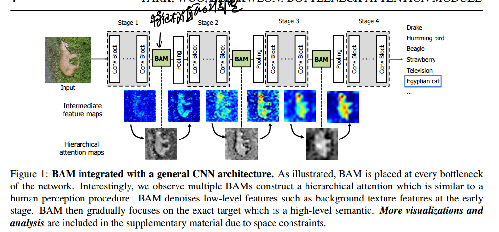
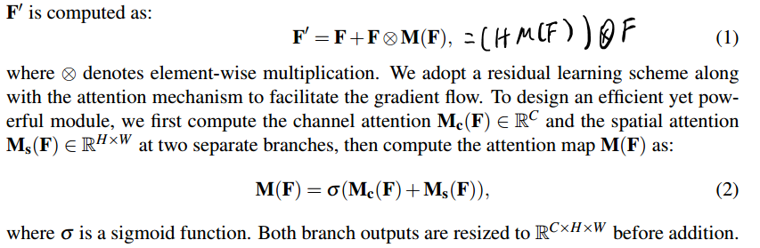
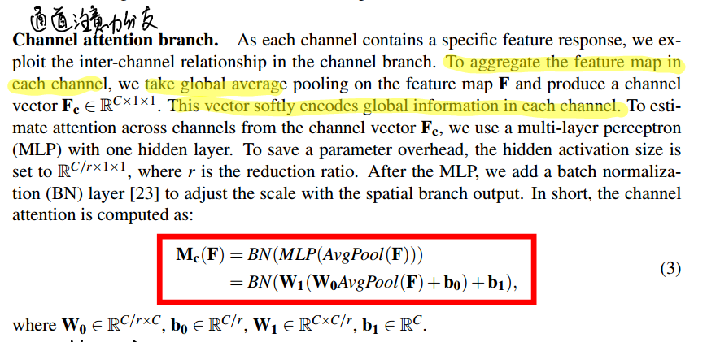
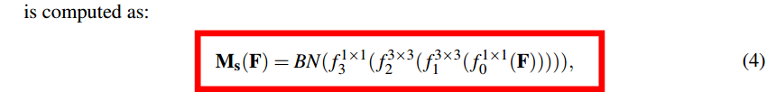
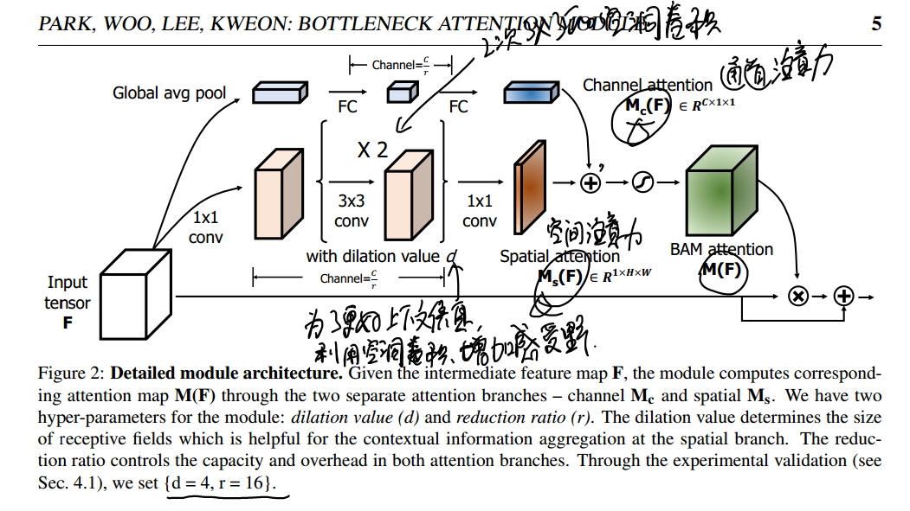

* [paper](paper/40.002-18-BAM--Bottleneck-Attention-Module.pdf)

### 动机

* SENet在调整特征权值的时候只是关注了通道间的信息，
* 本文将通道信息和位置信息分别用两个注意力模型实现，然后融合来调整输入特征图的权重。

### 网络结构

* 下面是block可以加入的方式，在原来的网络中加入来调整某些层的权重。

* 整体公式

* 通道注意力模型

* 空间注意力

* block框架

