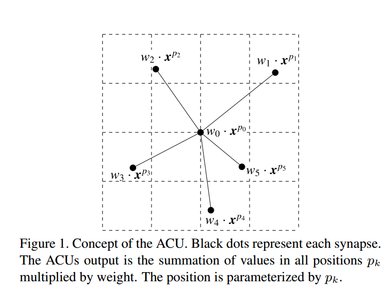
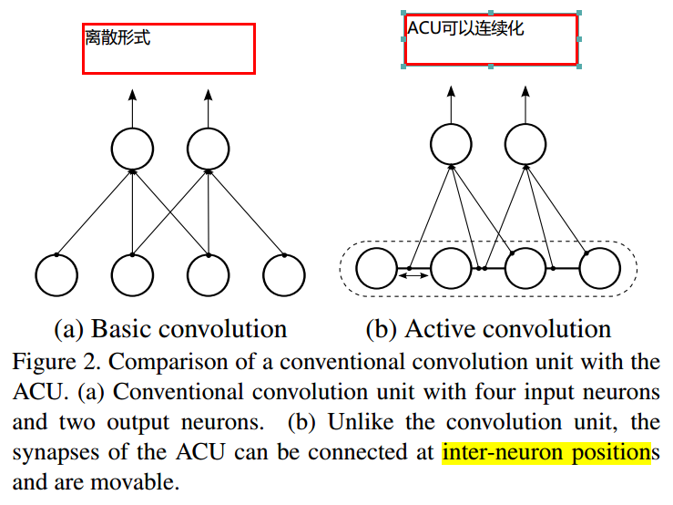
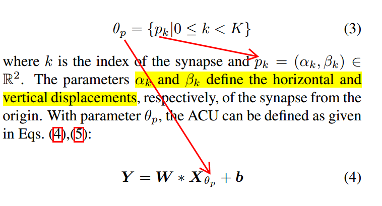
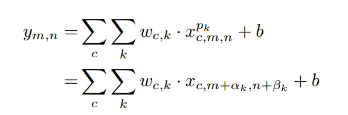
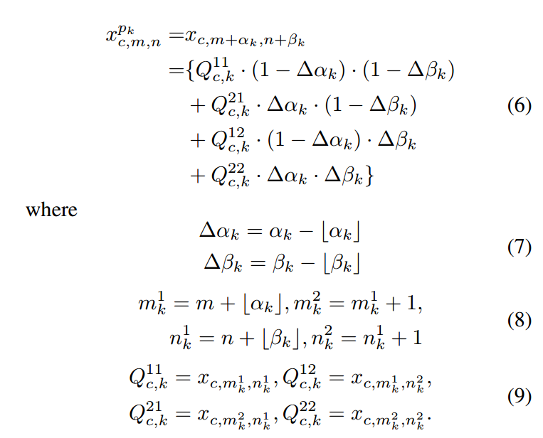
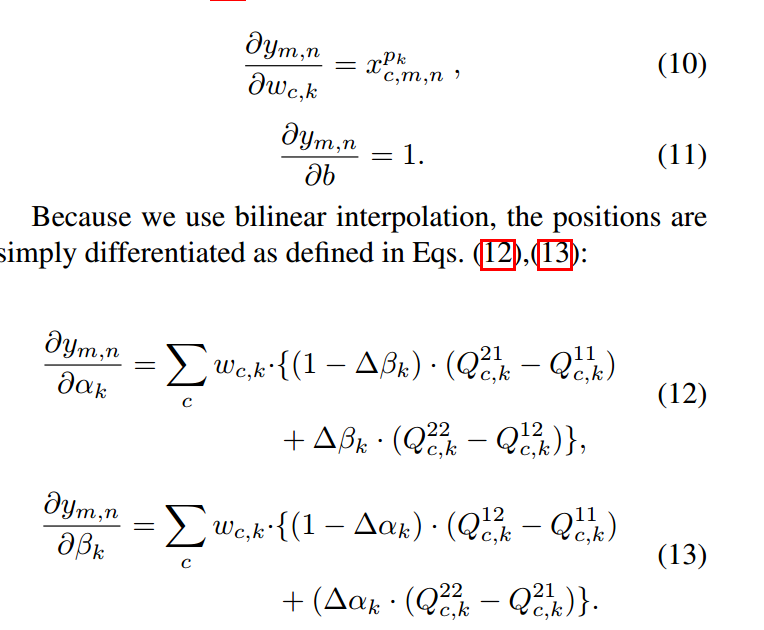

* [paper](paper/60.004-17-Active-Convolution--Learning-the-Shape-of-Convolution-for-Image-Classification.pdf)

#### 动机

* 以前的网络都是关注cnn的网络结构，比如ResNet，Inception等
* 这里关注卷积这个操作本身，

#### 贡献

* 提出了Active Convolution Unit，

#### 方法

* ACU概念

* ACU可以为具有可学习位置参数的卷积定义更多不同形式的感受域；
* 与传统卷积相比，ACU可以生成分数扩张卷积并用于直接计算内插卷积的结果。将离散的过程，连续化；

* 卷积公式：

* 前馈过程

* 反馈过程

#### 优点

1. ACU是卷积的推广; 它不仅可以定义所有常规卷积，还可以定义具有分数像素坐标的卷积。我们可以随意定义卷积的形状，这极大给CNN机构自由。
2. 卷积的形状是学习的在训练的时候，不需要手动调节；
3. ACU可以学习更好的卷积单元，我们可以获得提升仅仅通过改变方便的卷积。
