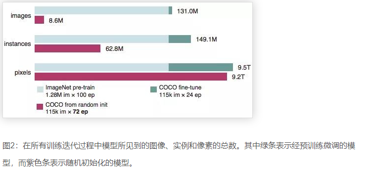
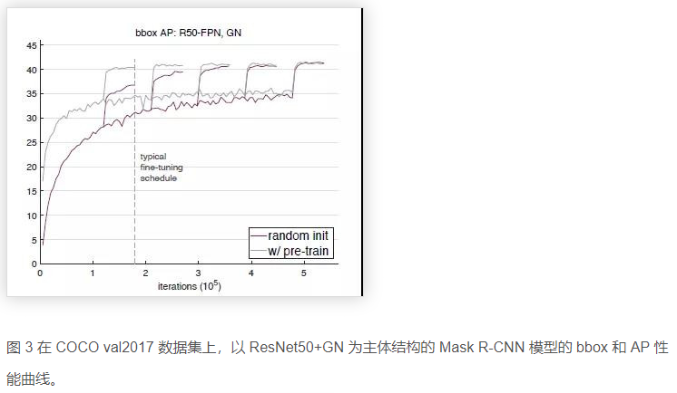
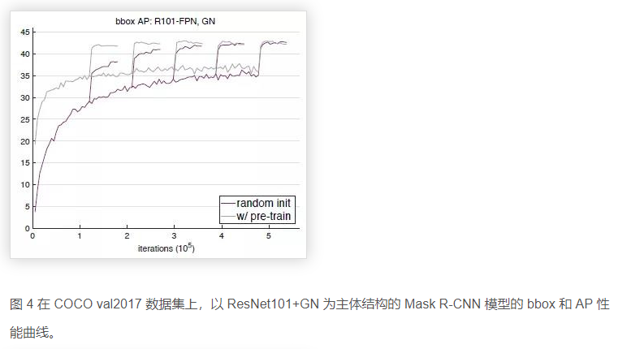
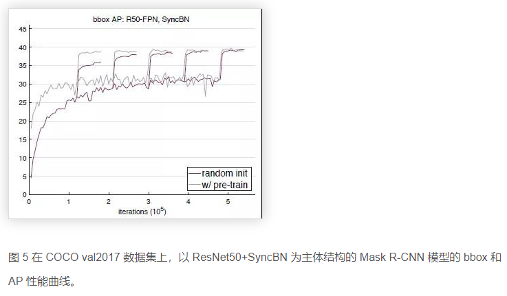
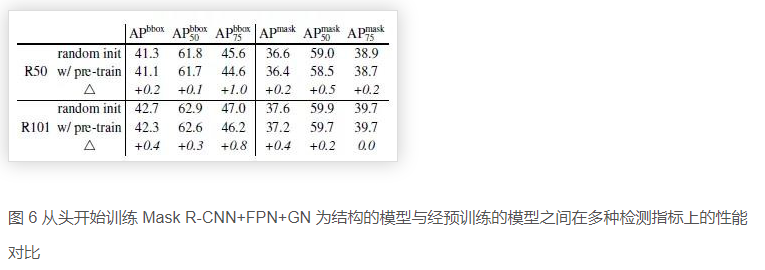
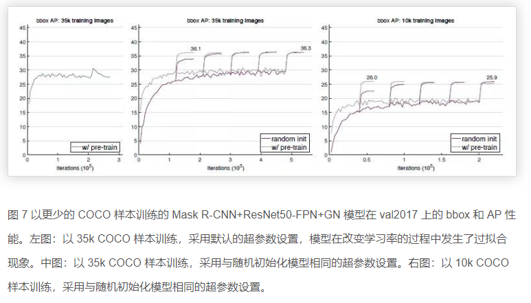

* [paper](paper/70.001-18-Rethinking-ImageNet-Pre-training.pdf)

## what

* 在目标检测和实例分割两个领域，我们使用随机初始化方法训练的模型，在 COCO 数据集上取得了非常鲁棒的结果。其结果并不比使用了 ImageNet 预训练的方法差，即使那些方法使用了 MaskR-CNN 系列基准的超参数。在以下三种情况，得到的结果仍然没有降低：
  1. 仅使用 10％ 的训练数据；
  2. 使用更深和更宽的模型
  3. 使用多个任务和指标。

ImageNet 预训练模型并非必须，ImageNet 能做的只是加速收敛，对最终物体检测的精度或实例分割的性能并无帮助。

## who （动机）

* 深度卷积神经网络方法为计算机视觉领域带来了新的活力，换言之，是因为发现使用预训练任务中学到的特征表示，能够将其中有用的信息传递给另一目标任务。
* 近年来，一个通用的方法（模式）是使用大规模数据（例如 ImageNet ）对模型进行预训练，然后在具有较少训练数据的目标任务上对模型进行微调。
* 预训练模型已经在许多任务上实现了最先进（state of the art）的结果，包括物体检测，图像分割和动作识别等任务。
* 但这种方法（预训练加微调）真的能解决计算机视觉领域的问题吗？我们提出了质疑。因此，通过实验展示了在 COCO 数据集上，我们使用随机初始化方法训练取得了和使用 ImageNet 预训练方法相媲美的结果，而且我们还发现仅使用 10% 的COCO 数据也能训练到差不多的结果。

## where

### 创新

- 使用 ImageNet 预训练能够加快收敛速度，特别是在训练初期。但是随机初始化的训练方法可以在训练了一段时间后赶上，该时间大致相当于 ImageNet 预训练加上微调的时间之和。 由于在研究目标任务时经常忽略 ImageNet 预训练的成本，因此会有使用预训练能缩短时间成本的假象，相反也忽略了随机初始化训练方法的真正作用。
- 使用 ImageNet 预训练的方法并不能自动提供更好的正则化效果。 当用较少的图像（低至 COCO 数据集的 10％）进行训练时，我们发现必须选择新的超参数来进行微调（微调初始参数来自预训练）以避免过拟合。 但是，当使用这些初始超参数进行随机初始化训练时，该模型可以达到使用预训练方法的精度并且不需要额外的正则化，即使仅使用 10％ 的 COCO 数据。
- 当目标任务/指标是需要更多使用局部空间信息来进行预测的任务时，ImageNet 预训练方法并没有展现出更强大的地方。我们观察到，当从头开始训练时，高重叠区域的 AP 会明显改善; 我们还发现了需要精准空间定位的关键点 AP，从头开始收敛速度相对较快。直观地说，基于分类的，类似 ImageNet 图片集的预训练任务和对局部敏感的目标任务，三者之间的差异可能会限制预训练方法发挥其功能。

## how

* 我们的目标是通过控制实验（有无ImageNet 预训练）来探究 ImageNet 预训练对模型性能的影响。考虑到这个问题，模型结构的改进并不是我们这项研究的目的; 实际上，为了能够更好地理解 ImageNet 预训练的作用，我们将基于当前最典型的模型结构，以最少的微调操作来探究预训练操作对模型性能的影响。下面，我们具体阐述在此研究中两个必要修改。

### 正则化

* 在图像分类任务中，正则化的引入能够辅助模型的优化过程。在以往的研究中，有效的正则化策略包括标准的参数初始（normalized parameter initialization）和激活正则化层（activation normalization layers）。对于目标检测任务，在不采用预训练模型而从头开始训练一个检测器时，往往会面临与从头训练一个分类器相似的问题。

* 批标准化（BN）是当前最流行的正则化方法，但在从头开始训练一个模型时，它的作用也变得微乎其微。特别地，不同于图像分类任务中的输入，目标检测器通常使用高分辨率的图像输入进行训练，BN 策略的引入虽然可以减少批量大小内存，但是小批量的输入会严重降低模型的准确性。

* 在这项研究中，我们应用最近提出的两种正则化策略，它们能够有助于缓解小批量输入的问题：
  1. Group Normalization (GN)：这是我们最近提出的，作为 BN 的一种替代策略。GN 方法的计算与输入的批量维度无关，因此引用该正则化方法时，模型准确性对输入的批量大小并不敏感。
  2. Synchronized Batch Normalization (SyncBN): 这是BN 的一种跨设备(GPU) 实现，能够统计多个设备的批量大小情况。当使用多个GPU 时，该正则化方法能够增加BN 的有效批量大小，从而避免小批量输入的问题。

* 我们的实验表明，当从头开始训练一个检测器时，GN 和 SyncBN 的正则化策略都是有效的。此外，我们还进一步探索了，使用合适的随机正则初始化策略，基于 VGG 架构的目标检测器能够在没有 BN 或 GN 方法的情况进行训练。

## 收敛性

* 显然，通过随机初始化过程的模型收敛速度与经 ImageNet 预训练初始化的收敛速度是相去甚远的。因为经预训练后，模型可能直接利用已学习的低级特征(边缘、纹理等) 而无需重新学习。此外，从头开始训练的模型需要学习目标的低级和高级语义，这可能需要更多的迭代过程才能更好地收敛。因此，在这项研究中我们考虑三种不同的 sample 定义：分别是图像和实例数量，以及在所有训练迭代过程中的像素数量。下图 2 显示了在 COCO 数据集上，一个从头开始训练的模型相比于预训练的模型，需要超过 3 倍的迭代数才能达到收敛状态。

* 我们的实验结果表明，从头开始训练的检测器，在总样本数量足够大(像素目标而言) 的情况下，以随机初始化开始训练也能很好地收敛，其性能也能够匹配上经预训练微调的模型。

## why

### 实验设置

我们对基准模型进行了微小的改变，总的来说，我们的基准设置和超参数都遵循 Mask R-CNN 模型，你可以在开源的 Detectron 项目中找到。此外，我们额外添加了正则化策略，并改变了模型迭代的步数，具体如下：

**模型结构：**我们采用 Mask R-CNN，ResNet 或 ResNeXt，并采用特征金字塔网络（FPN）作为我们模型的主体结构，并采用端到端的方式（end-to-end）来训练 RPN 和 Mask R-CNN。此外，GN/SyncBN 代替所有 frozen BN 层（逐通道的仿射变换）。为了公平比较，在研究过程中我们对预训练模型同样采用 GN 或 SyncBN 正则化策略进行微调。

**学习率方案：**Detectron 中原始版本的 Mask R-CNN 模型进行了 90k 步的微调迭代过程（1×schedule）或 180k 步的迭代（2×schedule）。对于本文中的模型，我们采用相似的术语，探究更长的训练过程。例如，所谓的 6×schedule 是带 540k 步迭代的微调过程。不论最终的迭代步数是多少，我们都遵循 2×schedule 策略，在最后的 60k 和 20k 时将学习率降低 10倍（即总是在运行相同的迭代步数后降低学习率）。在实验中，我们发现对于第一个（大）学习率，训练更长的时间是有用的，但对于较小的学习率，训练太久往往会导致过拟合现象的发生。

**超参数：**其他所有的超参数都遵循 Detectron 中的设置。特别是，初始学习率设置为 0.02，并采用 linear warm-up 策略，权重衰减率为 0.0001，动量参数设定为 0.9。我们在 8 个 GPU 上，采用 synchronized SGD，每个 GPU 上 mini-batch 大小为 2，来训练所有模型。

默认情况下，Detectron 中的 Mask R-CNN 在测试过程不使用数据扩充操作，在训练过程也只引入水平翻转的增强操作。在此，我们使用相同的设置，在无特别说明的情况下，图像较短边的像素值是 800。

### 实验结果与分析

**▌从头开始训练以匹配准确性**

* 实验中，我们发现当只使用 COCO 数据集时，从头开始训练的模型性能是能够匹配预训练模型的性能。我们在 COCO train2017 上训练模型，并在 COCO val2017 上验证模型的性能。训练数据集共有 118k 张图片，而验证集包含 5k 张图片。对于检测任务，我们评估了 bbox 和 AP（Aversage Precision）指标；对于实例分割，我们以 mask AP 作为评价标准。

**Baselines with GN and SyncBN**

* 下图 3，图 4 和图 5分别展示了 ResNet50+GN，ResNet101+GN 以及 ResNet50+SynaBN 在验证集上的 bbox 和 AP 性能曲线。每张图上我们的偶可以对比随机初始化训练的模型和经预训练微调的模型之间的性能差异。可以看到，在标准的 COCO 数据集上，从头开始训练的模型在 bbox 和 AP 上的表现，完全可以匹配经预训练微调的模型性能。而 ImageNet 数据集的预训练主要能够加速模型的收敛速度，并不会或很少提高模型最终的检测性能。

**Multiple detection metric**

下图 6 我们进一步比较了两种情况下模型在多种检测指标上的性能，包括分别在 IoU 阈值为 0.5 和 0.75的情况下，Mask R-CNN 模型的 box-level AP，segmentation-level AP。

**Models without BN/GN--VGG nets**

为了研究模型性能的泛化能力，我们以 VGG-16 作为主体结构，参考先前 Faster R-CNN 模型的实现过程，没有引入 FPN 架构，并采用标准的超参数方案，从头开始训练模型，并将其与在 ImageNet 上预训练的模型性能进行比较分析。我们发现，即使经 ImageNet 预训练的模型，其收敛的速度也很缓慢，而从头开始训练的模型最终也能达到与之相匹配的检测性能。

**▌用更少的数据从头开始训练**

实验过程中，我们还发现，随着数据量的减少，从头开始训练的模型性能并不会随之下降，仍然还能取得与预训练模型相匹配的性能。

**35k COCO training samples vs 10k COCO training samples**

我们分别从 COCO 数据集中随机选择 35k 和 10k 张训练数据，用于从头开始训练或基于预训练模型进行微调操作。下图 7 展示了二者在更少的训练数据上的 bbox 和 AP 性能对比。可以看到，尽管用更少的数据，从头开始训练的模型最终也能赶上预训练模型的性能。此外，经 ImageNet 预训练并不会有助于防止过拟合现象的发生。

## 结论与讨论

在这项研究中，我们主要研究了 ImageNet 预训练对模型性能的作用，并通过消融控制实验来分析不同正则化方法对模型性能及收敛速度的影响，总结如下：

- 在不需要对模型结构进行大幅度修改的情况下，可以在一个新的任务中从头开始训练一个模型。
- 从头开始训练一个模型通常需要更多的迭代步数才能获得充分的收敛。
- 从头开始训练的模型性能能够匹配的上经预训练的模型性能，即使是在只有 10k COCO 训练数据的情况下。
- 经 ImageNet 预训练的模型，在一个新的任务中能够加快收敛速度。
- 经 ImageNet 预训练的模型并不一定有助于减少过拟合现象的发生，除非我们采用非常小的数据。
- 如果我们的目标是比定位和分类更敏感的任务，那么 ImageNet 预训练对于模型的帮助将变得更小。

基于这些观察，我们尝试回答如下几个关键性的问题，希望能够鼓励研究者重新审视并思考ImageNet 预训练的作用：

- ImageNet 预训练是否有必要？事实并非如此，如果我们有足够的目标数据和计算资源的话，也许我们可以不依赖 ImageNet 的预训练。我们的实验结果表明，ImageNet 预训练可以帮助模型加速收敛过程，但是并不一定能提高最终的准确性，除非数据集特别小（例如，<10k COCO images）。这表明，在未来的研究中，收集目标数据的标注信息（而不是预训练数据）对于改善目标任务的表现是更有帮助的。
- ImageNet有用吗？确实是有用的。ImageNet 预训练一直以来是计算机视觉领域许多任务性能辅助工具。它能够减少了训练的周期，更容易获得有前途的结果，经预训练的模型能够多次使用，训练成本很低。此外，经预训练的模型能够有更快的收敛速度。我们相信 ImageNet 预训练仍然有助于计算机视觉研究。
- 我们需要大数据吗？的确需要。但如果我们考虑数据收集和清理的成本的话，一个通用的大规模分类的数据集并不是理想的选择。因为收集诸如 ImageNet 这样大数据集的成本被忽略掉了，而在数据集上进行预训练步骤的成本也是庞大的。如果在大规模的分类数据集上预训练的收益呈指数型下降减少，那么在目标域上收集数据将会是更有效的做法。
- 我们应该追求通用的模型性能吗？毫无疑问，我们的目标是模型能够学习到通用的特征表征。我们所取得的结果也没有偏离这一目标。其实，我们的研究表明在计算机视觉领域，我们应该更加注意评估预训练的特征（例如对于自监督过程的特征学习），就像现在我们学到的那样，即使是随机初始化过程也能得到出色的结果表现。