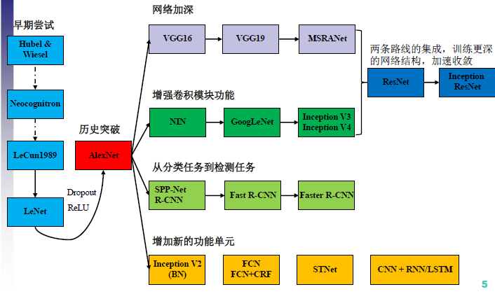

# tensorflow-classification-network
> 用TensorFlow实现各种分类网络（持续更新，现在主要是CNN）
* 本项目只负责cnn分类问题，

### data
* 数据集选择 cifar10 
    * 32 * 32 * 3
    * 10类
    * 5万张训练集+1万张测试数据
* resisc45
    * 卫星遥感数据
    * 45类
    * 256 * 256 * 3

### 分类网络
包含的网络有：
* [简单的5层CNN](cnn_01.py)
* [AlexNet](AlexNet.py) 
    * cifar10上利用4层最高69
* [VGGNet](VggNet.py)
* [InceptionNet](GoogLeNet.py)
* [ResNet](ResNet.py) 

### 代码结构

* layer: 卷积， 池化， 等
* Runner()： 训练和测试
* Data: 数据

### advance

* 用slim实现的更高级封装框架
    * Train:  训练网络
    * Eval: 验证网络
    * Prediction: 预测网络
