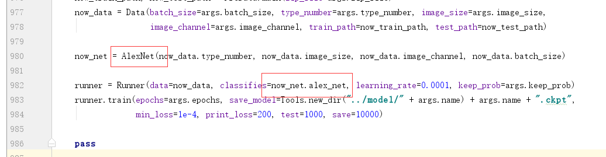
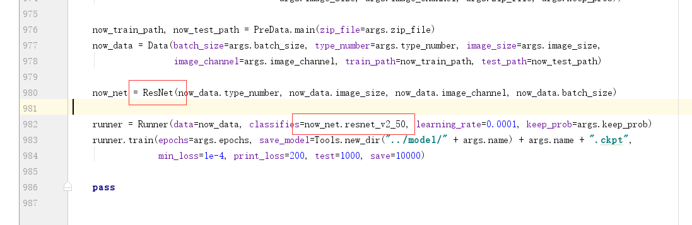

# tensorflow-classification-network
> 用TensorFlow实现各种分类网络（持续更新，现在主要是CNN）
* 本项目只负责cnn分类问题，

### 用法
- 安装所需python环境
- 只需要简单替换图中的部分，即可实现分类网络的切换

比如换成残差网络：

### data
* 数据集选择 cifar10 
    * 32 * 32 * 3
    * 10类
    * 5万张训练集+1万张测试数据
* resisc45
    * 卫星遥感数据
    * 45类
    * 256 * 256 * 3

### 分类网络
包含的网络有：
- 简单的5层CNN
- AlexNet 
    * cifar10上利用4层最高69
- VGGNet
- InceptionNet
- ResNet

### 参考文献

